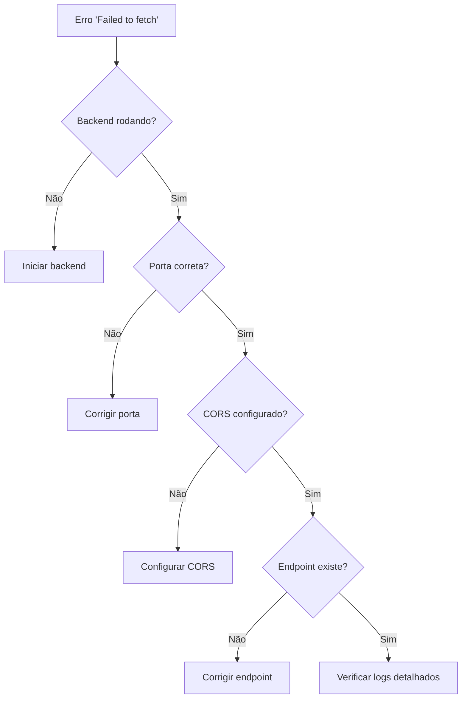

# 🔍 Diagnóstico: Erro "Failed to fetch" - Conectividade Frontend-Backend

## 📋 Descrição do Problema

O frontend Angular está falhando ao tentar se conectar com o backend Spring Boot, resultando no erro "Failed to fetch" no navegador. Este erro geralmente indica problemas de conectividade entre as aplicações.

## 🔍 Sintomas

- Erro `Failed to fetch` no console do navegador
- Requisições HTTP para `http://localhost:8080/api/*` falhando
- Funcionalidades que dependem de dados do backend não funcionam
- Possível erro `ERR_CONNECTION_REFUSED` ou `CORS error`

## 🕵️ Diagnóstico

### 1. Verificação do Status do Backend

**Comando para verificar se o backend está rodando:**
```bash
# Linux/macOS
lsof -i :8080

# Windows
netstat -ano | findstr :8080
```

**Resultado esperado:** Deve aparecer um processo Java/Spring Boot na porta 8080.

### 2. Teste de Conectividade Básica

**Testar endpoint de saúde:**
```bash
curl http://localhost:8080/actuator/health
```

**Resultado esperado:** `{"status":"UP"}`

### 3. Verificação de CORS

**Sintomas de problema CORS:**
- Erro `Access-Control-Allow-Origin` no console
- Requisição bloqueada pelo navegador

## 🛠️ Soluções

### Solução 1: Iniciar o Backend

```bash
# Navegar para o diretório do backend
cd plataforma-academica-spring

# Limpar e compilar
./mvnw clean compile

# Iniciar aplicação
./mvnw spring-boot:run
```

**Verificação:** A aplicação deve iniciar e mostrar logs como:
```
Tomcat started on port(s): 8080 (http)
Started PlataformaAcademicaApplication
```

### Solução 2: Corrigir Configuração de Porta

**Arquivo:** `plataforma-academica-spring/src/main/resources/application.properties`

```properties
# Verificar configuração da porta
server.port=8080
```

**Se a porta estiver ocupada, alterar para:**
```properties
server.port=8081
```

**Atualizar frontend:** `plataforma-academica-angular/src/environments/environment.ts`

```typescript
export const environment = {
  production: false,
  apiUrl: 'http://localhost:8081/api'  // Atualizar porta se necessário
};
```

### Solução 3: Configurar CORS

**Arquivo:** `plataforma-academica-spring/src/main/resources/application.properties`

```properties
# Configuração CORS
spring.web.cors.allowed-origins=http://localhost:4200
spring.web.cors.allowed-methods=GET,POST,PUT,DELETE,OPTIONS
spring.web.cors.allowed-headers=*
spring.web.cors.allow-credentials=true
```

**Ou via código Java (Classe de configuração):**
```java
@Configuration
public class CorsConfig {

    @Bean
    public CorsFilter corsFilter() {
        CorsConfiguration config = new CorsConfiguration();
        config.addAllowedOrigin("http://localhost:4200");
        config.addAllowedMethod("*");
        config.addAllowedHeader("*");
        config.setAllowCredentials(true);

        UrlBasedCorsConfigurationSource source = new UrlBasedCorsConfigurationSource();
        source.registerCorsConfiguration("/api/**", config);
        return new CorsFilter(source);
    }
}
```

### Solução 4: Verificar Configuração do Frontend

**Arquivo:** `plataforma-academica-angular/src/environments/environment.ts`

```typescript
export const environment = {
  production: false,
  apiUrl: 'http://localhost:8080/api'
};
```

**Verificar serviços HTTP:**
```typescript
// Exemplo em usuario.service.ts
@Injectable({
  providedIn: 'root'
})
export class UsuarioService {
  private baseUrl = environment.apiUrl + '/usuarios';

  constructor(private http: HttpClient) { }

  getUsuarios(): Observable<Usuario[]> {
    return this.http.get<Usuario[]>(this.baseUrl);
  }
}
```

## 🔧 Verificações Adicionais

### 1. Firewall e Antivírus
- Desabilitar temporariamente firewall/antivírus
- Verificar se a porta 8080 não está bloqueada

### 2. Conflito de Portas
```bash
# Verificar processos usando a porta
lsof -i :8080
kill -9 <PID>
```

### 3. Logs Detalhados

**Backend - Habilitar logs de debug:**
```properties
# application.properties
logging.level.org.springframework.web=DEBUG
logging.level.com.plataforma_academica=DEBUG
```

**Frontend - Verificar Network tab:**
- DevTools → Network
- Verificar status das requisições
- Headers de resposta

### 4. Teste de Conectividade Direta

**Testar API diretamente:**
```bash
# Testar endpoint
curl -X GET http://localhost:8080/api/usuarios \
  -H "Content-Type: application/json"

# Com autenticação (se necessário)
curl -X GET http://localhost:8080/api/usuarios \
  -H "Authorization: Bearer <token>" \
  -H "Content-Type: application/json"
```

## 📊 Fluxograma de Diagnóstico



## 📞 Suporte

Se o problema persistir:

1. **Verificar versão das dependências**
2. **Comparar com configuração funcional**
3. **Consultar logs completos da aplicação**
4. **Testar em ambiente isolado**

**Documentos relacionados:**
- `SOLUCAO_ERROS.md` - Problemas comuns
- `CONFIGURACAO_LOGIN_SOCIAL.md` - Configuração OAuth
- `README.md` - Setup completo

Última atualização: Março 2026

Para:
```typescript
import { environment } from '../../environments/environment';
private baseUrl = `${environment.apiUrl}/usuarios`;
```

#### **Opção C: Mock do backend (para testes)**

Se você ainda não tem o backend pronto, podemos criar um mock/stub dos dados para testar o frontend.

### **Como verificar se o backend está respondendo:**

```bash
# No terminal, teste a conexão
curl http://localhost:8080/api/usuarios

# Ou use o navegador
# Vá para: http://localhost:8080/api/usuarios
```

**Por favor, verifique qual porta seu backend está rodando e me avise!**
