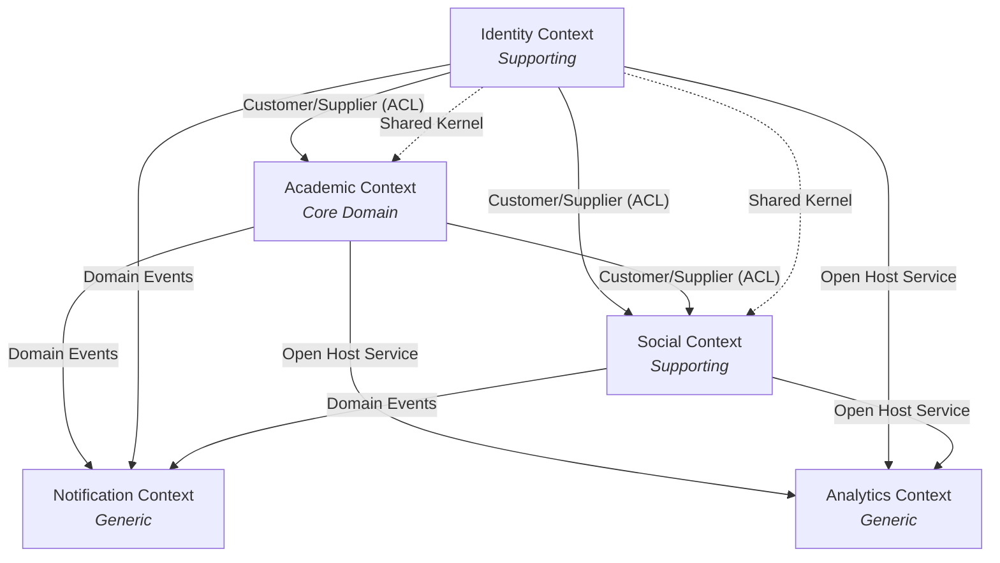
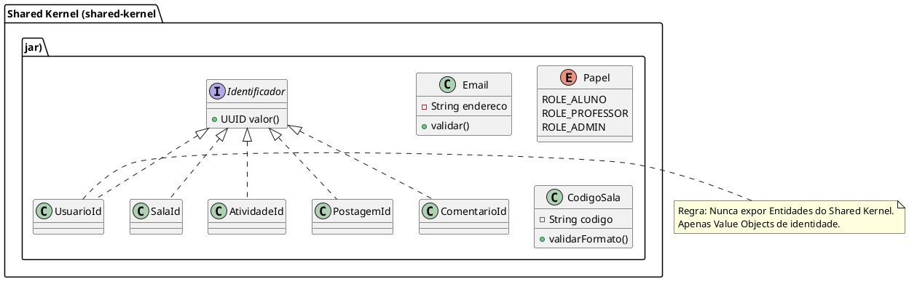

# 🗺️ Mapa de Contextos (Context Map) — Visão Estratégica

Este documento define o mapa estratégico de contextos da Plataforma Acadêmica, estabelecendo os limites, relacionamentos e estratégias de integração entre os subdomínios.

---

## 1. Visão Geral dos Contextos

| Contexto | Tipo DDD | Responsabilidade Principal | Status |
|----------|----------|----------------------------|--------|
| **Academic Context** | **Core Domain** | Ciclo de vida do ensino-aprendizagem (Salas, Atividades, Submissões, Notas) | 🟢 Implementado |
| **Identity Context** | **Supporting Subdomain** | Identidade, Autenticação, Perfis, Amizades, Gamificação | 🟢 Implementado |
| **Social Context** | **Supporting Subdomain** | Feed, Postagens, Comentários, Interações (Likes) | 🟢 Implementado |
| **Notification Context** | **Generic Subdomain** | Envio de e-mails, push, in-app notifications | 🟡 Planejado |
| **Analytics Context** | **Generic Subdomain** | Dashboards, Relatórios, Métricas de engajamento | 🟡 Planejado |

---

## 2. Diagrama de Context Map (PlantUML)

```plantuml
@startuml ContextMap
!define RECTANGLE class

skinparam rectangle {
    BackgroundColor<<Core>> #E8F5E9
    BorderColor<<Core>> #2E7D32
    BackgroundColor<<Supporting>> #E3F2FD
    BorderColor<<Supporting>> #1565C0
    BackgroundColor<<Generic>> #FFF3E0
    BorderColor<<Generic>> #EF6C00
    BackgroundColor<<SharedKernel>> #F3E5F5
    BorderColor<<SharedKernel>> #7B1FA2
}

package "Plataforma Acadêmica Integrada" {

    RECTANGLE "Academic Context\n<<Core Domain>>" as Academic <<Core>> {
    }

    RECTANGLE "Identity Context\n<<Supporting Subdomain>>" as Identity <<Supporting>> {
    }

    RECTANGLE "Social Context\n<<Supporting Subdomain>>" as Social <<Supporting>> {
    }

    RECTANGLE "Notification Context\n<<Generic Subdomain>>" as Notification <<Generic>> {
    }

    RECTANGLE "Analytics Context\n<<Generic Subdomain>>" as Analytics <<Generic>> {
    }

    ' Shared Kernel
    package "Shared Kernel" as SK <<SharedKernel>> {
        [UsuarioId]
        [Email]
        [Papel]
        [CodigoSala]
    }
}

' Relacionamentos
' Identity -> Academic (Customer/Supplier)
Identity --> Academic : Customer/Supplier\n(Identity fornece UsuarioId, Papel)

' Academic -> Identity (Conformist)
Academic --> Identity : Conformist\n(Consome UsuarioId, Papel via ACL)

' Social -> Identity (Customer/Supplier + ACL)
Social --> Identity : Customer/Supplier + ACL\n(Consulta amizades, perfis)

' Social -> Academic (Customer/Supplier + ACL)
Social --> Academic : Customer/Supplier + ACL\n(Consome AtividadeResumida para comentários)

' Academic -> Notification (Published Language / Event-Driven)
Academic --> Notification : Published Language\n(Domain Events: AtividadePublicada, SubmissaoAvaliada)

' Identity -> Notification (Published Language)
Identity --> Notification : Published Language\n(Domain Events: UsuarioCadastrado, SolicitacaoAmizade)

' Social -> Notification (Published Language)
Social --> Notification : Published Language\n(Domain Events: PostagemCriada, ComentarioAdicionado)

' Todos -> Analytics (Open Host Service / Event Stream)
Academic --> Analytics : Open Host Service\n(Event Stream: Todos eventos)
Identity --> Analytics : Open Host Service\n(Event Stream: Todos eventos)
Social --> Analytics : Open Host Service\n(Event Stream: Todos eventos)

@enduml
```

### 2.3. Visão Mermaid (Renderização Rápida no GitHub/VS Code)



---

## 3. Tabela de Relacionamentos e Padrões de Integração

| Upstream (Fornecedor) | Downstream (Consumidor) | Padrão | Descrição Técnica |
|----------------------|------------------------|--------|-------------------|
| **Identity Context** | **Academic Context** | **Customer/Supplier** | Academic depende de `UsuarioId` e `Papel` válidos. Identity expõe `UsuarioRepository` e `Papel` via porta. |
| **Academic Context** | **Identity Context** | **Conformist** | Identity consome eventos `SalaCriadaEvent` para sugerir conexões; não negocia contrato. |
| **Identity Context** | **Social Context** | **Customer/Supplier + ACL** | Social usa `SocialIdentityPort` (ACL) para consultar `saoAmigos()` e `buscarAmigos()` sem acoplar ao modelo rico de Identity. |
| **Academic Context** | **Social Context** | **Customer/Supplier + ACL** | Social usa `AcademicContextACL` para obter `AtividadeResumidaDTO` (id, titulo, salaId) para permitir comentários em atividades. |
| **Academic Context** | **Notification Context** | **Published Language (Async Events)** | Eventos: `AtividadePublicadaEvent`, `SubmissaoAvaliadaEvent`. Contrato versionado (Avro/JSON Schema). |
| **Identity Context** | **Notification Context** | **Published Language (Async Events)** | Eventos: `UsuarioCadastradoEvent`, `SolicitacaoAmizadeEnviadaEvent`. |
| **Social Context** | **Notification Context** | **Published Language (Async Events)** | Eventos: `PostagemCriadaEvent`, `ComentarioAdicionadoEvent`. |
| **Todos Contextos** | **Analytics Context** | **Open Host Service** | Stream de eventos imutáveis (Kafka/Event Hub) com schema registry para dashboards. |

---

## 4. Shared Kernel (Núcleo Compartilhado)

O **Shared Kernel** é **mínimo e imutável**, contendo apenas Value Objects de identidade compartilhados fisicamente (mesmo JAR/módulo) entre todos os contextos.



### Regras do Shared Kernel
1. **Versionamento sincronizado**: Qualquer alteração exige deploy coordenado de todos os contextos.
2. **Apenas Value Objects de Identidade**: Nenhuma Entidade, Agregado ou Regra de Negócio vive aqui.
3. **Propriedade compartilhada**: Time "Platform" mantém; times dos contextos **não** modificam diretamente.

---

## 5. Anti-Corruption Layers (ACLs)

### 5.1 `SocialIdentityPort` (Social → Identity)
```java
// No Social Context: domain.ports.inbound
public interface SocialIdentityPort {
    boolean saoAmigos(UsuarioId u1, UsuarioId u2);
    List<UsuarioId> buscarAmigos(UsuarioId usuarioId);
    Optional<PerfilUsuarioResumido> buscarPerfilResumido(UsuarioId id);
}

// Adapter no Identity Context: infrastructure.adapters.outbound
@Component
class SocialIdentityAdapter implements SocialIdentityPort {
    private final UsuarioRepository usuarioRepo;
    private final ConexaoAmizadeRepository conexaoRepo;

    public boolean saoAmigos(UsuarioId u1, UsuarioId u2) {
        return conexaoRepo.findEntreUsuarios(u1, u2)
            .map(c -> c.getStatus() == StatusAmizade.ACEITO)
            .orElse(false);
    }
    // ...
}
```

### 5.2 `AcademicContextACL` (Social → Academic)
```java
// No Social Context: domain.ports.inbound
public interface AcademicContextACL {
    Optional<AtividadeResumida> buscarAtividadeResumida(AtividadeId id);
    List<AtividadeResumida> buscarAtividadesDaSala(SalaId salaId);
}

// DTO imutável (não vaza Entidade Atividade)
public record AtividadeResumida(
    AtividadeId id,
    String titulo,
    SalaId salaId,
    UsuarioId criadorId
) {}
```

---

## 6. Contratos de Eventos (Published Language)

Todos os eventos seguem **CloudEvents 1.0** + **Avro Schema** versionado.

### Exemplo: `AtividadePublicadaEvent` (v1)
```json
{
  "specversion": "1.0",
  "type": "br.com.plataforma.academic.AtividadePublicada.v1",
  "source": "/contexts/academic",
  "id": "evt-{{uuid}}",
  "time": "{{ISO8601}}",
  "datacontenttype": "application/avro",
  "data": {
    "atividadeId": "uuid",
    "salaId": "uuid",
    "titulo": "string",
    "descricao": "string",
    "prazoEntrega": "ISO8601",
    "pontuacaoMaxima": 100.0,
    "criadorId": "uuid"
  }
}
```

### Governança de Eventos
| Regra | Descrição |
|-------|-----------|
| **Backward Compatibility** | Novos campos são *optional* com default. |
| **Schema Registry** | Confluent Schema Registry / Apicurio (Avro). |
| **Tópicos Kafka** | `academic.atividade.publicada.v1`, `identity.usuario.cadastrado.v1`, etc. |
| **Consumer-Driven Contracts** | Testes Pact/Postman validam consumidores antes de deploy do producer. |

---

## 7. Decisões Arquiteturais (ADRs) Relacionadas

| ADR | Título | Status |
|-----|--------|--------|
| **ADR-001** | Adoção de DDD Modular (Bounded Contexts por módulo Maven/Gradle) | ✅ Aceito |
| **ADR-003** | Comunicação Assíncrona via Domain Events (Kafka) para cross-context | ✅ Aceito |
| **ADR-007** | Shared Kernel restrito a Value Objects de Identidade | ✅ Aceito |
| **ADR-012** | ACLs obrigatórias para consultas cross-context (zero acoplamento de domínio) | ✅ Aceito |

---

## 8. Próximos Passos (Roadmap Estratégico)

1.  [ ] Implementar `Notification Context` como consumidor de eventos.
2.  [ ] Configurar **Schema Registry** e tópicos Kafka por contexto.
3.  [ ] Criar testes de contrato (Pact) para `SocialIdentityPort` e `AcademicContextACL`.
4.  [ ] Documentar **Sagas** para fluxos cross-context (ex: `CriarSalaSaga`).
5.  [ ] Definir **Read Models / Projeções CQRS** para Feed Social e Dashboard Docente.