# Arquitetura de Banco de Dados — Modelo Relacional e Diagrama ER (UML)

Este documento apresenta o modelo relacional completo e o diagrama entidade-relacionamento (ER / UML) do banco de dados da **Plataforma Acadêmica**, estruturado em conformidade com o padrão arquitetural Sênior/Staff e os domínios mapeados (`Identity`, `Academic`, `Social`).

---

## 📐 1. Diagrama Entidade-Relacionamento (Mermaid UML)

```mermaid
erDiagram
    USUARIO {
        bigint id PK
        varchar nome
        varchar sobrenome
        varchar email UK
        varchar senha
        date data_nascimento
        varchar telefone
        text descricao
        varchar instituicao_ensino
        varchar cep
        varchar pais
        varchar cidade
        varchar site
        blob avatar
        text foto_perfil
        double pontos
        double moedas
        varchar nivel
        varchar tipo_usuario
        bigint plataforma_id FK
    }

    PROFESSOR {
        bigint id PK, FK
        varchar matricula
    }

    ADMIN {
        bigint id PK, FK
    }

    PERFIL {
        bigint id PK, FK
        text bio
        text foto_perfil
        varchar curso
    }

    PLATAFORMA {
        bigint id PK
        varchar nome
    }

    POSTAGEM {
        bigint id PK
        varchar titulo
        text conteudo
        integer curtidas
        varchar imagem_url
        bigint usuario_id FK
        bigint plataforma_id FK
    }

    COMENTARIO {
        bigint id PK
        text conteudo
        timestamp data_criacao
        varchar tipo_destino
        bigint autor_id FK
        bigint postagem_id FK
        bigint atividade_id FK
        bigint sala_de_aula_id FK
    }

    CURTIDA {
        bigint id PK
        bigint usuario_id FK
        bigint postagem_id FK
    }

    SALA_DE_AULA {
        bigint id PK
        varchar nome
        varchar codigo_sala UK
        bigint criador_id FK
    }

    SALA_MEMBROS {
        bigint sala_id PK, FK
        bigint usuario_id PK, FK
    }

    ATIVIDADE {
        bigint id PK
        varchar titulo
        varchar descricao
        varchar tipo_documento_submissao
        date data_entrega
        double pontos
        varchar documento_url
        bigint autor_id FK
        bigint sala_id FK
    }

    SUBMISSAO_ATIVIDADE {
        bigint id PK
        varchar url_documento
        text descricao
        timestamp data_submissao
        double nota
        text feedback
        timestamp data_correcao
        boolean recebida
        timestamp data_recebimento
        bigint atividade_id FK
        bigint aluno_id FK
    }

    COMUNIDADE {
        bigint id PK
        varchar nome
        varchar descricao
        timestamp criado_em
        bigint dono_id FK
    }

    MEMBRO_COMUNIDADE {
        bigint id PK
        varchar papel
        timestamp entrou_em
        bigint usuario_id FK
        bigint comunidade_id FK
    }

    AMIZADE {
        bigint id PK
        varchar status
        timestamp criado_em
        bigint solicitante_id FK
        bigint destinatario_id FK
    }

    SOLICITACAO_ENTRADA {
        bigint id PK
        varchar status
        timestamp data_solicitacao
        timestamp data_resposta
        bigint sala_id FK
        bigint usuario_id FK
    }

    NOTIFICACAO {
        bigint id PK
        text mensagem
        varchar tipo
        bigint referencia_id
        boolean lida
        timestamp data_criacao
        bigint usuario_id FK
    }

    MENSAGEM {
        bigint id PK
        bigint remetente_id
        bigint destinatario_id
        text conteudo
        timestamp criado_em
        boolean lida
    }

    FREQUENCIA {
        bigint id PK
        date data
        boolean presente
        text justificativa
        bigint aluno_id FK
        bigint sala_id FK
    }

    INTERACAO_USUARIO {
        bigint id PK
        varchar tipo_interacao
        varchar entidade_tipo
        bigint entidade_id
        double peso_interacao
        timestamp data_interacao
        varchar tags
        bigint usuario_id FK
    }

    RECOMENDACAO_USUARIO {
        bigint id PK
        double score_similaridade
        varchar motivo_recomendacao
        varchar tipo_recomendacao
        timestamp data_criacao
        boolean ativo
        bigint usuario_id FK
        bigint usuario_recomendado_id FK
    }

    CONTEUDO_MERCADO {
        bigint id PK
        varchar titulo
        text descricao
        varchar tipo_conteudo
        decimal preco
        varchar caminho_arquivo
        varchar url_download
        varchar thumbnail_url
        integer downloads
        double avaliacao
        integer total_avaliacoes
        boolean ativo
        timestamp data_criacao
        timestamp data_atualizacao
        varchar tags
        varchar nivel_dificuldade
        varchar categoria
        bigint autor_id FK
    }

    USUARIO ||--o{ PROFESSOR : heranca_joined
    USUARIO ||--o{ ADMIN : heranca_joined
    USUARIO ||--o{ PERFIL : heranca_joined
    PLATAFORMA ||--o{ USUARIO : possui
    PLATAFORMA ||--o{ POSTAGEM : possui
    USUARIO ||--o{ POSTAGEM : escreve
    USUARIO ||--o{ COMENTARIO : comenta
    POSTAGEM ||--o{ COMENTARIO : recebe
    ATIVIDADE ||--o{ COMENTARIO : recebe
    SALA_DE_AULA ||--o{ COMENTARIO : recebe
    USUARIO ||--o{ CURTIDA : curte
    POSTAGEM ||--o{ CURTIDA : recebe
    USUARIO ||--o{ SALA_DE_AULA : cria
    SALA_DE_AULA ||--o{ SALA_MEMBROS : contem
    USUARIO ||--o{ SALA_MEMBROS : participa
    USUARIO ||--o{ ATIVIDADE : publica
    SALA_DE_AULA ||--o{ ATIVIDADE : contem
    ATIVIDADE ||--o{ SUBMISSAO_ATIVIDADE : exige
    USUARIO ||--o{ SUBMISSAO_ATIVIDADE : submete
    USUARIO ||--o{ COMUNIDADE : lidera
    COMUNIDADE ||--o{ MEMBRO_COMUNIDADE : possui
    USUARIO ||--o{ MEMBRO_COMUNIDADE : ingressa
    USUARIO ||--o{ AMIZADE : solicita
    USUARIO ||--o{ AMIZADE : recebe
    SALA_DE_AULA ||--o{ SOLICITACAO_ENTRADA : recebe
    USUARIO ||--o{ SOLICITACAO_ENTRADA : solicita
    USUARIO ||--o{ NOTIFICACAO : recebe
    USUARIO ||--o{ FREQUENCIA : registra
    SALA_DE_AULA ||--o{ FREQUENCIA : possui
    USUARIO ||--o{ INTERACAO_USUARIO : gera
    USUARIO ||--o{ RECOMENDACAO_USUARIO : alvo
    USUARIO ||--o{ RECOMENDACAO_USUARIO : recomendado
    USUARIO ||--o{ CONTEUDO_MERCADO : publica
```

---

## 📋 2. Dicionário de Dados e Relacionamentos

### 2.1 Contexto de Identidade & Usuários (`usuario`, `professor`, `admins`, `perfis`)
*   **`usuario`**: Tabela raiz que armazena credenciais e dados cadastrais. Utiliza estratégia JPA `InheritanceType.JOINED`.
*   **`professor`**, **`admins`**, **`perfis`**: Tabelas especializadas ligadas à tabela `usuario` por chave estrangeira 1:1 (`id`).

### 2.2 Contexto Acadêmico (`sala_de_aula`, `atividade`, `submissaoatividade`, `solicitacao_entrada`, `frequencia`)
*   **`sala_de_aula`**: Representa salas virtuais criadas por professores (`criador_id`).
*   **`sala_membros`**: Tabela de junção Many-to-Many entre `sala_de_aula` e `usuario`.
*   **`atividade`**: Tarefas avaliativas atreladas a uma `sala_de_aula` e criadas por um `autor` (professor).
*   **`submissaoatividade`**: Entregas de tarefas feitas por alunos para uma `atividade`.
*   **`solicitacao_entrada`**: Controle de moderação para acesso a salas de aula restritas.
*   **`frequencia`**: Registro de presença/ausência de alunos por aula/data.

### 2.3 Contexto Social & Engajamento (`comunidades`, `membros_comunidade`, `amizades`, `postagens`, `comentarios`, `curtida`, `mensagens`, `notificacao`)
*   **`comunidades`** / **`membros_comunidade`**: Grupos de interesse e suas associações com papéis (`ADMIN`, `MOD`, `MEMBRO`).
*   **`amizades`**: Conexões de amizade com ciclo de vida em `Status` (`PENDENTE`, `ACEITO`, `RECUSADO`).
*   **`postagens`** / **`comentarios`** / **`curtida`**: Timeline social e interações baseadas em polimorfismo de destino (`TipoDestinoComentario`).
*   **`mensagens`**: Chat direto entre pares (remetente/destinatário).
*   **`notificacao`**: Alertas assíncronos gerados para eventos acadêmicos e sociais.

### 2.4 Contexto de Inteligência & Mercado (`interacao_usuario`, `recomendacao_usuario`, `conteudo_mercado`)
*   **`interacao_usuario`**: Log ponderado de interações para cálculo de similaridade.
*   **`recomendacao_usuario`**: Cache de recomendações geradas por algoritmos (amizade, grupos, mentoria).
*   **`conteudo_mercado`**: Marketplace de materiais didáticos publicados por usuários.
