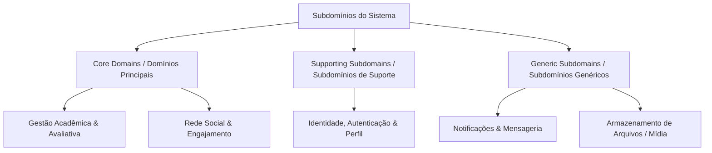
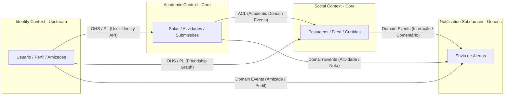

# 🏗️ Documentação de Arquitetura e Design Estratégico Domain-Driven Design (DDD) - Plataforma Acadêmica

Este documento estabelece a especificação arquitetural de alto nível baseada em **Domain-Driven Design (DDD)** para a Plataforma Acadêmica Integrada. Ele define a divisão estratégica de domínios, a delimitação de contextos (**Bounded Contexts**), o **Context Map** (Mapa de Contextos), os padrões de integração e a linguagem ubíqua global da aplicação.

---

## 🎯 Visão Estratégica do Domínio

O domínio de negócio da aplicação é o **Ecossistema de Aprendizagem e Engajamento Acadêmico Colaborativo**. O propósito fundamental do sistema é maximizar o desempenho acadêmico, a gestão pedagógica e a retenção do aluno por meio da integração harmônica entre gestão de salas de aula virtuais, avaliação contínua e redes sociais acadêmicas.

---

## 🗺️ Taxonomia e Mapeamento de Subdomínios

Para gerenciar a complexidade do software e focar os recursos de engenharia onde existe o maior diferencial competitivo, o domínio é dividido em três categorias estratégicas de subdomínios:



### 1. Core Domains (Domínios Principais)
*Representam a proposta de valor única do produto. Recebem a maior atenção técnica e refinamento de modelagem rica.*

* **A. Gestão Acadêmica e Avaliativa (`Academic Context`)**
  * **Foco:** Ciclo de vida completo das disciplinas virtuais, gestão de turmas, criação de tarefas com pontuação, controle rigoroso de prazos e fluxo de submissão/avaliação docente com feedback.
  * **Justificativa Estratégica:** É o motivo primário pelo qual professores e alunos utilizam a plataforma no dia a dia acadêmico.

* **B. Rede Social e Engajamento Colaborativo (`Social Context`)**
  * **Foco:** Feed dinâmico de conhecimento, compartilhamento de artigos, discussões, sistema de interações (curtidas/reações) e algoritmo de relevância de conteúdo acadêmico.
  * **Justificativa Estratégica:** Aumenta o engajamento e o tempo de permanência, transformando uma ferramenta administrativa passiva em uma comunidade viva.

### 2. Supporting Subdomains (Subdomínios de Suporte)
*Específicos do negócio e essenciais para a operação do Core Domain, mas que não constituem vantagem competitiva por si sós.*

* **C. Gestão de Identidade, Autenticação e Relações (`Identity Context`)**
  * **Foco:** Cadastro de usuários, autenticação OAuth2/JWT, perfis, controle de papéis/permissões (`ROLE_ALUNO`, `ROLE_PROFESSOR`, `ROLE_ADMIN`) e o grafo de conexões/amizades entre membros da instituição.

### 3. Generic Subdomains (Subdomínios Genéricos)
*Funcionalidades sem especificidade de regra de negócio pedagógica. Podem ser resolvidos por bibliotecas de mercado, serviços SaaS ou abstrações reutilizáveis.*

* **D. Notificações e Mensageria (`Notification Subdomain`)**
  * **Foco:** Entrega de alertas (e-mail, push, in-app) acionada por eventos de domínio.
* **E. Armazenamento e Distribuição de Arquivos (`Storage Subdomain`)**
  * **Foco:** Upload e download seguro de artefatos acadêmicos (PDFs, documentos, imagens de perfil).

---

## 🏗️ Bounded Contexts (Contextos Delimitados)

Cada Bounded Context possui seu próprio modelo conceitual, sua linguagem ubíqua e suas fronteiras explícitas de persistência e código no Spring Boot.

| Contexto Delimitado | Tipo de Subdomínio | Responsabilidade Primária | Agregados Principais |
| :--- | :--- | :--- | :--- |
| **`Identity Context`** | Suporte | Gestão de credenciais, autenticação, perfis públicos e grafo de amizades. | `Usuario`, `ConexaoAmizade` |
| **`Academic Context`** | Core Domain | Turmas virtuais, ciclo de atividades, entregas dos alunos e notas/feedback. | `SalaDeAula`, `Atividade`, `SubmissaoAtividade` |
| **`Social Context`** | Core Domain | Publicações no feed, comentários, compartilhamentos e reações de engajamento. | `Postagem`, `InteracaoEngajamento` |

---

## 🗺️ Context Map (Mapa de Contextos e Padrões de Integração)

O Context Map detalha como os Bounded Contexts interagem, identificando a direção de dependência (Upstream/Downstream) e os padrões formais de integração DDD (ACL, OHS/PL, Customer-Supplier):



### Análise dos Padrões de Integração do Mapa:

1. **`Identity Context` → `Academic Context` (Customer-Supplier / OHS + PL)**
   * **Relação:** `Identity` atua como **Upstream (U)** fornecendo a identidade do usuário (`UsuarioId`, papéis e dados básicos) para o `Academic Context` (**Downstream - D**).
   * **Mecanismo:** O `Identity Context` expõe um **Open Host Service (OHS)** com uma **Published Language (PL)** (Contrato REST/DTO desacoplado ou Value Objects compartilhados em nível de aplicação).

2. **`Identity Context` → `Social Context` (Customer-Supplier / OHS + PL)**
   * **Relação:** O `Social Context` necessita validar se dois usuários possuem vínculo de amizade ativo para aplicar os filtros de feed (`FILTRO_AMIGOS`).
   * **Mecanismo:** Consulta via contrato de serviço do `Identity Context` sem expor as entidades internas de amizade para o modelo do social.

3. **`Academic Context` → `Social Context` (Conformist / Anti-Corruption Layer - ACL)**
   * **Relação:** Quando uma atividade ou nota é publicada, o contexto social pode expor uma discussão ou atualização automática no feed.
   * **Mecanismo:** O `Social Context` utiliza uma **Anti-Corruption Layer (ACL)** para traduzir eventos acadêmicos (`AtividadePublicadaEvent`) em objetos de seu próprio domínio social (`PostagemAcademica`), garantindo que mudanças no modelo acadêmico não quebrem o modelo do feed social.

4. **Event-Driven Integration (Eventual Consistency via Domain Events)**
   * O acoplamento síncrono é estritamente evitado entre Core Domains. Alterações de estado disparam **Domain Events** que são consumidos assincronamente por outros contextos ou pelo subdomínio genérico de Notificações.

---

## 🏛️ Padrão Arquitetural Interno dos Contextos (Hexagonal / Ports & Adapters)

Cada Bounded Context dentro do projeto [plataforma-academica-spring](plataforma-academica-spring) adota uma arquitetura limpa em camadas (Ports & Adapters), isolando completamente as regras de negócio de frameworks e detalhes de infraestrutura:

```
br.com.plataformaacademica.<contexto>/
├── domain/                         # 🧠 CAMADA DE DOMÍNIO (Lógica de Negócio Pura - Zero Dependências Spring/JPA)
│   ├── model/                      # Entidades Ricas, Agregados e Value Objects
│   │   ├── aggregates/             # Agregados do Contexto
│   │   ├── entities/               # Entidades Filhas
│   │   └── valueobjects/           # Objetos de Valor Imutáveis com Autovalidação
│   ├── events/                     # Eventos de Domínio Immutable
│   ├── exceptions/                 # Exceções de Regra de Negócio de Domínio
│   ├── services/                   # Domain Services (Lógica que envolve múltiplos agregados)
│   └── ports/                      # Interfaces de Saída (Output Ports)
│       ├── repositories/           # Contratos de Repositório de Domínio
│       └── suppliers/              # Contratos para serviços externos (ex: Notificador, Hash)
├── application/                    # ⚙️ CAMADA DE APLICAÇÃO (Orquestração de Casos de Uso)
│   ├── usecases/                   # Interfaces e Implementações dos Casos de Uso
│   ├── dtos/                       # Command & Query DTOs de Entrada e Saída
│   └── handlers/                   # Event Handlers e Listeners de Eventos de Domínio
└── infrastructure/                 # 🔌 CAMADA DE INFRAESTRUTURA (Detalhes Técnicos & Adapters)
    ├── adapters/
    │   ├── in/web/                 # REST Controllers (Adapters de Entrada)
    │   └── out/persistence/        # Impl de Repositórios Spring Data JPA + Mappers JPA (Adapters de Saída)
    └── configuration/              # Beans Spring e Configurações de Segurança
```

---

## 📖 Dicionário e Linguagem Ubíqua Global (Ubiquitous Language)

Estes termos possuem significado rigoroso e único em todos os artefatos de código, conversas de equipe e documentações:

| Termo em Português | Termo no Código (Java) | Contexto Delimitado | Definição Rorosa de Negócio |
| :--- | :--- | :--- | :--- |
| **Sala de Aula Virtual** | `SalaDeAula` | `Academic` | Ambiente delimitado criado por um docente para agrupar discentes, gerenciar conteúdos e aplicar atividades. |
| **Código de Acesso** | `CodigoSala` | `Academic` | Token único alfanumérico imutável de 8 caracteres que concede direito de ingresso em uma Sala de Aula. |
| **Atividade Acadêmica** | `Atividade` | `Academic` | Unidade de trabalho avaliativa com título, descrição, prazo final impreterível e pontuação máxima. |
| **Submissão** | `SubmissaoAtividade` | `Academic` | Artefato (documento/link) e registro temporal enviado por um aluno como resposta a uma Atividade. |
| **Avaliação & Feedback** | `Nota` / `Feedback` | `Academic` | Parecer qualitativo e nota quantitativa (entre `0.0` e `pontuacaoMax`) atribuídos exclusivamente pelo docente autor da sala. |
| **Usuário** | `Usuario` | `Identity` | Entidade individual com credenciais, e-mail único validado, papéis institucionais e atributos de gamificação. |
| **Conexão de Amizade** | `ConexaoAmizade` | `Identity` | Relacionamento bidirecional entre dois usuários com estados estritos (`PENDENTE`, `ACEITO`, `RECUSADO`, `BLOQUEADO`). |
| **Postagem** | `Postagem` | `Social` | Publicação de texto, imagem ou link compartilhada no feed institucional com visibilidade configurável. |
| **Engajamento / Curtida** | `InteracaoEngajamento` | `Social` | Reação atômica única de um usuário a um item do feed (impossibilitando duplicidade por usuário/alvo). |

