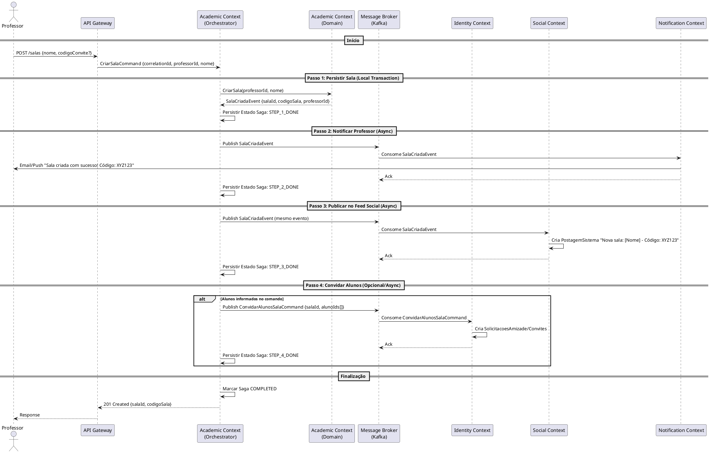

# 🔄 Sagas — Orquestração de Fluxos Cross-Context

Este documento define as **Sagas** (Gerenciadores de Processo) responsáveis por coordenar transações de longa duração que atravessam múltiplos *Bounded Contexts*, garantindo consistência eventual sem acoplamento temporal.

---

## 1. Princípios de Design das Sagas

| Princípio | Descrição |
|-----------|-----------|
| **Coreografia vs Orquestração** | Usamos **Orquestração Explícita** (Saga Orchestrator/Process Manager) para fluxos críticos de negócio, pois oferece visibilidade, compensação determinística e facilita depuração. |
| **Idempotência** | Todos os comandos e manipuladores de eventos **devem ser idempotentes** (chave de idempotência: `correlationId` + `stepId`). |
| **Compensação (Rollback)** | Cada passo possui uma ação de compensação explícita. Falha em qualquer passo dispara a execução reversa dos passos já concluídos. |
| **Persistência de Estado** | O estado da Saga (`PENDING`, `RUNNING`, `COMPLETED`, `COMPENSATING`, `FAILED`) é persistido em armazenamento dedicado (tabela `saga_log` / Event Store). |
| **Timeouts** | Passos assíncronos possuem TTL configurável. Expiração dispara compensação ou alerta operacional. |

---

## 2. Saga: `CriarSalaSaga`

**Gatilho**: Comando `CriarSalaCommand` originado da API Gateway / Application Service do **Academic Context**.

**Objetivo**: Criar a sala no domínio acadêmico, notificar o professor criador, notificar alunos convidados (se houver) e publicar anúncio no feed social.

### 2.1. Diagrama de Sequência (PlantUML)



### 2.2. Definição dos Passos (Steps)

| Step ID | Ação (Forward) | Contexto Responsável | Evento/Comando Emitido | Compensação (Backward) | Timeout |
|---------|----------------|----------------------|------------------------|------------------------|---------|
| **1** | `CriarSala` | **Academic** (Local) | `SalaCriadaEvent` | `ExcluirSala(salaId)` | 5s (sync) |
| **2** | `NotificarProfessor` | **Notification** | `EnviarNotificacaoCommand` | `RegistrarFalhaNotificacao(log)` | 30s |
| **3** | `PublicarFeedSocial` | **Social** | `CriarPostagemSistemaCommand` | `ExcluirPostagem(postagemId)` | 30s |
| **4** | `ConvidarAlunos` | **Identity** | `ConvidarAlunosSalaCommand` | `CancelarConvites(salaId)` | 60s |

### 2.3. Estado da Saga (State Machine)

```mermaid
stateDiagram-v2
    [*] --> STARTED: CriarSalaCommand
    STARTED --> STEP_1_DONE: SalaCriadaEvent
    STEP_1_DONE --> STEP_2_DONE: NotificacaoEnviadaEvent
    STEP_2_DONE --> STEP_3_DONE: PostagemCriadaEvent
    STEP_3_DONE --> STEP_4_DONE: ConvitesEnviadosEvent (opcional)
    STEP_4_DONE --> COMPLETED
    STEP_3_DONE --> COMPLETED: Se sem alunos

    STEP_1_DONE --> COMPENSATING_STEP_1: Falha Step 2/3/4
    STEP_2_DONE --> COMPENSATING_STEP_2: Falha Step 3/4

---

## 3. Estratégias de Idempotência e Correlação

Para garantir a confiabilidade da Saga em um ambiente distribuído:

1.  **Correlation ID**: Todo comando e evento gerado pela Saga carrega o `correlationId` original. Isso permite rastrear o fluxo completo no log de eventos e telemetria (OpenTelemetry).
2.  **Outbox Pattern**: O **Academic Context** utiliza o padrão *Transactional Outbox* para garantir que a persistência da sala e a publicação do `SalaCriadaEvent` ocorram de forma atômica.
3.  **Idempotent Consumers**:
    *   **Social Context**: Antes de criar a postagem, verifica se já existe uma postagem com o `correlationId` da saga.
    *   **Notification Context**: Utiliza o `correlationId` como chave de deduplicação para evitar o envio de e-mails duplicados em caso de retentativas do broker.

---

## 4. Tratamento de Falhas e Compensação

### Exemplo: Falha no Passo 3 (Social)
Se o Social Context falhar ao criar a postagem após 3 retentativas:
1.  O Orquestrador detecta o erro ou timeout.
2.  O Orquestrador dispara o comando de compensação `ExcluirSala(salaId)` para o Academic Context.
3.  O Academic Context marca a sala como `CANCELADA_POR_ERRO_SISTEMA` (Soft Delete) para auditoria.
4.  A Saga é marcada como `FAILED`.

    STEP_3_DONE --> COMPENSATING_STEP_3: Falha Step 4

    COMPENSATING_STEP_3 --> COMPENSATING_STEP_2: ExcluirPostagem OK
    COMPENSATING_STEP_2 --> COMPENSATING_STEP_1: RegistrarFalhaNotificacao OK
    COMPENSATING_STEP_1 --> FAILED: ExcluirSala OK

    COMPLETED --> [*]
    FAILED --> [*]
```

### 2.4. Implementação do Orchestrator (Pseudo-código)

```java
// Academic Context: application.saga
@Component
public class CriarSalaSagaOrchestrator {

    private final SagaRepository sagaRepo;
    private final AcademicCommandGateway academicGateway;
    private final EventPublisher eventPublisher;

    @Transactional
    public void handle(CriarSalaCommand cmd) {
        SagaInstance saga = SagaInstance.start("CriarSalaSaga", cmd.correlationId());
        try {
            // Step 1: Local Transaction
            Sala sala = academicGateway.criarSala(cmd.professorId(), cmd.nome());
            saga.recordStep("STEP_1", sala.id());

            // Step 2: Async - Notificação
            eventPublisher.publish(new SalaCriadaEvent(sala.id(), sala.codigo(), cmd.professorId()));
            saga.recordStep("STEP_2");

            // Step 3: Async - Social Feed
            // Mesmo evento é consumido pelo Social Context via ACL
            saga.recordStep("STEP_3");

            // Step 4: Async - Convites (se aplicável)
            if (cmd.alunoIds() != null && !cmd.alunoIds().isEmpty()) {
                eventPublisher.publish(new ConvidarAlunosSalaCommand(sala.id(), cmd.alunoIds()));
                saga.recordStep("STEP_4");
            }

            saga.complete();
        } catch (Exception e) {
            saga.fail(e);
            triggerCompensation(saga);
        } finally {
            sagaRepo.save(saga);
        }
    }

    @EventListener
    public void on(NotificacaoEnviadaEvent evt) {
        resumeSaga(evt.correlationId(), "STEP_2");
    }

    @EventListener
    public void on(PostagemCriadaEvent evt) {
        resumeSaga(evt.correlationId(), "STEP_3");
    }

    private void triggerCompensation(SagaInstance saga) {
        // Executa passos de compensação em ordem reversa
        // Ex: saga.getCompletedSteps().reversed().forEach(this::executeCompensation);
    }
}
```

---

## 3. Outras Sagas Candidatas (Backlog)

| Saga | Gatilho | Contextos Envolvidos | Prioridade |
|------|---------|---------------------|------------|
| **`SubmissaoAvaliacaoSaga`** | `SubmissaoAvaliadaEvent` | Academic → Identity (Gamificação) → Notification → Social (Feed) | Alta |
| **`SolicitacaoAmizadeSaga`** | `SolicitacaoAmizadeEnviadaEvent` | Identity → Notification | Média |
| **`EncerramentoSemestreSaga`** | Job Scheduler (Cron) | Academic → Identity (Relatórios) → Analytics | Baixa |

---

## 4. Infraestrutura Necessária

1.  **Saga Log Store**: Tabela `saga_instances` (correlationId, currentState, payload, createdAt, updatedAt).
2.  **Outbox Pattern**: Garantir publicação atômica de eventos junto com a persistência do passo local (evita dual-write).
3.  **Dead Letter Queue (DLQ)**: Para eventos que falham repetidamente na compensação.
4.  **Observabilidade**: Métricas `saga_duration_seconds`, `saga_failed_total`, `saga_compensating_total` (Prometheus/Grafana).