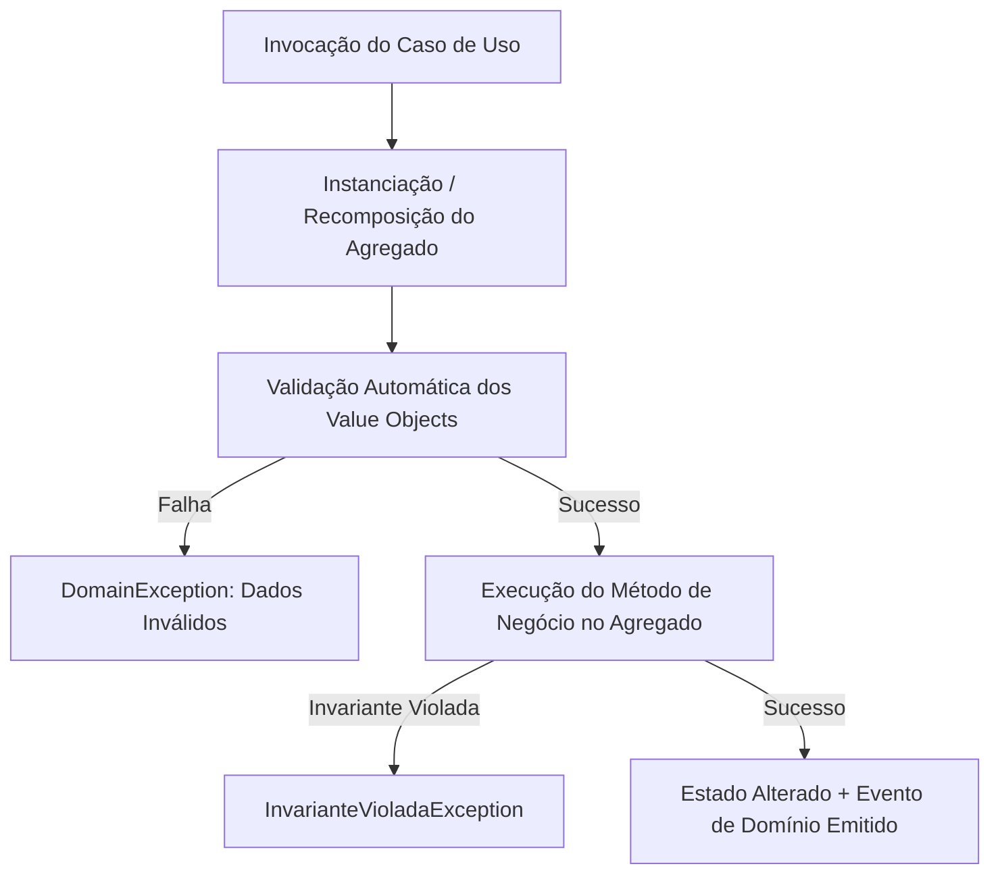

# 🚀 Racional Arquitetural: Migração de MVC Anêmico para DDD Estratégico & Tático

Este documento apresenta a justificativa técnica e executiva para a transição arquitetural da Plataforma Acadêmica Integrada do padrão tradicional **Monolítico MVC Anêmico** para o **Domain-Driven Design (DDD) Tático e Estratégico com Arquitetura Limpa (Hexagonal)**.

---

## ⚖️ Análise Comparativa: MVC Anêmico vs. Modelo Rico Tático DDD

| Dimensão Arquitetural | Padrão Tradicional (MVC Anêmico) | Padrão Adotado (DDD & Modelo Rico) | Impacto no Projeto Acadêmico |
| :--- | :--- | :--- | :--- |
| **Localização das Regras** | Espalhadas em `Services` de centenas de linhas e `Controllers`. | Encapsuladas nos **Agregados**, **Entidades** e **Value Objects**. | Garante que as regras de negócio de notas e prazos nunca sejam ignoradas. |
| **Entidades de Domínio** | Meros sacos de dados (apenas Getters/Setters e anotações JPA). | **Rich Domain Model** com construtores privados e métodos de negócio expressivos. | Impossibilita estados inválidos ou corrupção de dados em memória. |
| **Integridade de Dados** | Depende unicamente de validações na camada Web (`@Valid`) e Constraints SQL. | **Garantia de Invariantes** em tempo de instanciação de Value Objects e Agregados. | Testes unitários puros sem subir Spring ou Banco de Dados (execução em milissegundos). |
| **Acoplamento** | Altíssimo acoplamento entre banco de dados (JPA/Hibernate) e regras de negócio. | **Isolamento de Domínio** (Zero dependência de frameworks na camada `domain`). | Facilidade para trocar o ORM, banco de dados ou framework Web sem alterar o core. |
| **Comunicação entre Módulos** | Invocação direta de tabelas/repositórios de outros contextos. | **Eventos de Domínio** (`DomainEvents`) e **Anti-Corruption Layers (ACL)**. | Alterações no Feed Social não quebram o lançamento de Notas Acadêmicas. |

---

## ❌ Diagnóstico dos Problemas Resolvidos

### 1. O Sintoma do "Big Ball of Mud" (A Grande Bola de Lama)
Em arquiteturas MVC tradicionais, à medida que a plataforma cresce adicionando módulos como chat, gamificação e emissão de certificados, a classe `UsuarioService` ou `AtividadeService` tende a se tornar uma *God Class* imantada por dezenas de dependências injetadas.
* **Solução DDD:** O estabelecimento rigoroso de **Bounded Contexts** e **Agregados**. Cada contexto (`Academic`, `Identity`, `Social`) é dono absoluto do seu ciclo de vida de dados e comportamento, sem vazamento de estado.

### 2. O Risco das Entidades Anêmicas e Quebra de Invariantes
No modelo anêmico, qualquer desenvolvedor pode chamar `atividade.setPontos(-50.0)` ou `submissao.setNota(15.0)` (quando o máximo era 10.0), pois os métodos `setters` públicos expõem a estrutura interna sem qualquer validação.
* **Solução DDD:** O modelo de **Rich Domain Model**. Os setters são eliminados ou tornados privados. Operações de negócio ocorrem através de métodos de domínio com intenção clara: `atividade.avaliarSubmissao(submissaoId, nota, professorId)`. Se a nota for inválida, uma exceção de domínio (`NotaInvalidaException`) é disparada imediatamente dentro da classe `Nota`.

### 3. A Barreira Semântica entre Tecnologia e Negócio
Muitas vezes o código utiliza termos puramente técnicos como `UserAccountEntity` ou `ClassroomUserRelTable`, enquanto coordenadores e professores utilizam `MembroSala`, `Submissao` ou `Feedback`.
* **Solução DDD:** Adoção da **Ubiquitous Language (Linguagem Ubíqua)**. O código Java utiliza exatamente as mesmas palavras do vocabulário pedagógico, reduzindo o custo cognitivo de onboarding de novos desenvolvedores e o risco de erros de interpretação das regras.

---

## 🛡️ Invariantes de Negócio Protegidas no Domínio

A tabela abaixo ilustra como as invariantes críticas da aplicação passam a ser protegidas no nível de domínios e objetos de valor:

Exemplos de Invariantes Garantidas:
1. **`CodigoSala`:** Impossível criar um objeto `CodigoSala` que não possua exatamente 8 caracteres alfanuméricos.
2. **`Nota`:** Não pode ser negativa e não pode exceder a pontuação máxima configurada na `Atividade`.
3. **`PrazoEntrega`:** A data de entrega de uma atividade deve ser estritamente posterior à data de publicação.
4. **`SubmissaoAtividade`:** O aluno só pode enviar submissão se for membro ativo da `SalaDeAula` e o prazo não tiver expirado (a menos que a sala permita entregas com atraso e penalidade).

---

## 📐 Trade-offs e Análise de Sobriedade Arquitetural

Como Especialista Arquiteto, reconhece-se que a adoção de DDD possui trade-offs que devem ser conscientemente gerenciados:

| Desafio / Custo de DDD | Estratégia de Mitigação na Plataforma Acadêmica |
| :--- | :--- |
| **Complexidade Inicial / Boilerplate** | O código requer a criação de mappers entre Entidades de Domínio e Entidades JPA (`PersistenceMapper`). Mitigado com padrão MapStruct e construtores bem definidos. |
| **Consistência Eventual (Eventual Consistency)** | A comunicação entre agregados via eventos exige resiliência. Mitigado com salvamento atômico de eventos (Outbox Pattern) no Spring Boot. |
| **Curva de Aprendizado do Time** | Mitigado pela padronização clara de pastas, uso da biblioteca de documentação de contexto e guias de implementação técnica. |

---

## 🎯 Conclusão

A migração para DDD garante que a **Plataforma Acadêmica Integrada** atinja um nível enterprise de confiabilidade, testabilidade e manutenibilidade. O investimento na modelagem rica se paga rapidamente ao prevenir bugs graves em produção no cálculo de notas, permissões de salas e privacidade de usuários.