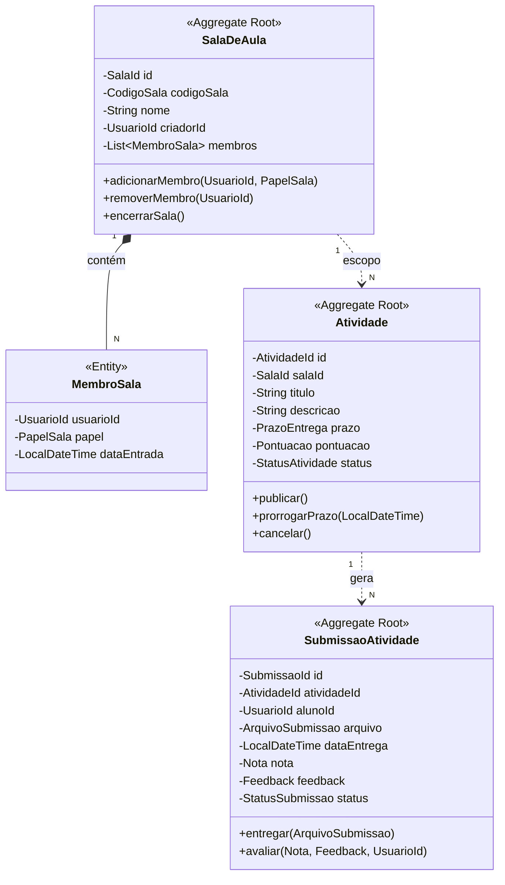

# 🎓 Contexto Acadêmico (Academic Context) — Especificação Tática de Domínio

O **Contexto Acadêmico** é o **Domínio Principal** (Core Domain) da Plataforma Acadêmica Integrada. Ele gerencia o ciclo de vida do processo de ensino-aprendizagem, englobando ambientes virtuais de aprendizagem, ciclo de tarefas avaliativas e o fluxo rigoroso de submissão, correção e atribuição de notas.

---

## 🎯 Escopo do Contexto e Linguagem Ubíqua

* **Linguagem Ubíqua do Contexto:**
  * **`SalaDeAula`:** Agregado raiz que agrupa membros (docentes e discentes) sob um código de acesso único.
  * **`Atividade`:** Agregado que define uma tarefa avaliativa com regras de entrega, pontuação e prazos.
  * **`SubmissaoAtividade`:** Agregado que registra a entrega de um discente e o parecer/nota atribuído pelo docente.
  * **`CodigoSala`:** Objeto de valor imutável que representa a chave alfanumérica de entrada na sala.
  * **`Nota`:** Objeto de valor imutável que representa o desempenho numérico obtido, validado contra a pontuação máxima da atividade.

---

## 🏗️ Design Tático: Agregados, Raízes e Fronteiras Transacionais



---

### 1. Agregado: `SalaDeAula`

#### **Fronteira do Agregado:**
* **Raiz do Agregado (`Aggregate Root`):** `SalaDeAula`
* **Entidades Internas:** `MembroSala`
* **Value Objects:** `SalaId`, `CodigoSala`, `UsuarioId`, `PapelSala` (Enum: `CRIADOR`, `DOCENTE`, `DISCENTE`)

#### **Invariantes e Regras de Negócio Inegociáveis:**
1. **Geração de Código:** Todo novo agregado `SalaDeAula` deve ser instanciado gerando automaticamente um `CodigoSala` válido (8 caracteres alfanuméricos únicos).
2. **Propriedade e Docência:** O `criadorId` é automaticamente registrado como membro com papel `CRIADOR`/`DOCENTE`. Apenas o criador pode renomear ou encerrar a sala.
3. **Unicidade de Membros:** Um `UsuarioId` não pode ser inserido duplicadamente na lista de membros da mesma sala.
4. **Isolamento de Conteúdo:** Usuários não cadastrados como membros da sala não possuem acesso a ler atividades ou realizar entregas.

---

### 2. Agregado: `Atividade`

#### **Fronteira do Agregado:**
* **Raiz do Agregado (`Aggregate Root`):** `Atividade`
* **Value Objects:** `AtividadeId`, `SalaId`, `PrazoEntrega`, `Pontuacao`, `StatusAtividade` (Enum: `RASCUNHO`, `PUBLICADA`, `ENCERRADA`, `CANCELADA`)

#### **Invariantes e Regras de Negócio Inegociáveis:**
1. **Validação do Prazo:** O `PrazoEntrega` deve ser obrigatoriamente uma data/hora no futuro em relação ao momento de publicação.
2. **Pontuação Positiva:** O Value Object `Pontuacao` não aceita valores negativos e possui limite superior configurado no domínio (`0.0` a `100.0`).
3. **Imutabilidade de Atividade Encerrada:** Atividades com status `ENCERRADA` não podem ter seu prazo alterado nem receber novas submissões.

---

### 3. Agregado: `SubmissaoAtividade`

#### **Fronteira do Agregado:**
* **Raiz do Agregado (`Aggregate Root`):** `SubmissaoAtividade`
* **Value Objects:** `SubmissaoId`, `AtividadeId`, `UsuarioId` (Aluno), `ArquivoSubmissao`, `Nota`, `Feedback`, `StatusSubmissao` (Enum: `RASCUNHO`, `ENTREGUE`, `EM_AVALIACAO`, `AVALIADA`)

#### **Invariantes e Regras de Negócio Inegociáveis:**
1. **Unicidade da Submissão:** Um aluno (`UsuarioId`) só pode ter **uma** submissão ativa por `AtividadeId`. Tentativas de entrega subsequentes devem atualizar a submissão existente se o prazo permitir.
2. **Restrição de Prazo:** O método `entregar()` valida se a `dataEntrega` atual respeita o `PrazoEntrega` da atividade.
3. **Validação da Nota:** A `Nota` atribuída pelo docente não pode exceder a `Pontuacao` máxima definida na `Atividade`. Tentar atribuir nota maior resulta em disparo imediato de `NotaInvalidaException`.
4. **Autorização de Avaliação:** A avaliação (`avaliar()`) exige o `docenteId` avaliador para validar se ele possui privilégio de docente na sala correspondente.

---

## 💎 Objetos de Valor (Value Objects) Ricos

```java
// Exemplo de Especificação do Value Object Nota
public final record Nota(BigDecimal valor) {
    public Nota {
        if (valor == null) {
            throw new IllegalArgumentException("A nota não pode ser nula.");
        }
        if (valor.compareTo(BigDecimal.ZERO) < 0) {
            throw new NotaInvalidaException("A nota não pode ser negativa.");
        }
    }

    public void validarContraPontuacaoMaxima(Pontuacao pontuacaoMaxima) {
        if (this.valor.compareTo(pontuacaoMaxima.valor()) > 0) {
            throw new NotaExcedePontuacaoMaximaException(this, pontuacaoMaxima);
        }
    }
}
```

* **`CodigoSala`:** Encapsula validação regex de 8 caracteres alfanuméricos sem caracteres ambíguos.
* **`PrazoEntrega`:** Encapsula comparações temporais (`isExpirado()`, `isEntregaEmAtraso()`).
* **`ArquivoSubmissao`:** Valida extensões permitidas (`PDF`, `DOCX`, `ZIP`) e tamanho do arquivo.

---

## 🔔 Eventos de Domínio (Domain Events)

Os eventos de domínio garantem a comunicação assíncrona desacoplada com outros contextos:

1. **`SalaCriadaEvent`**
   * *Payload:* `SalaId`, `CodigoSala`, `UsuarioId` (Criador), `OccurredOn`.
   * *Consumidores:* `Notification Context` (enviar confirmação ao professor).
2. **`AtividadePublicadaEvent`**
   * *Payload:* `AtividadeId`, `SalaId`, `Titulo`, `PrazoEntrega`, `Pontuacao`, `OccurredOn`.
   * *Consumidores:* `Notification Context` (notificar todos os alunos da sala), `Social Context` (publicar card no feed via ACL).
3. **`SubmissaoRealizadaEvent`**
   * *Payload:* `SubmissaoId`, `AtividadeId`, `UsuarioId` (Aluno), `DataEntrega`, `OccurredOn`.
   * *Consumidores:* `Notification Context` (notificar docente), `Identity Context` (computar pontos no motor de gamificação).
4. **`SubmissaoAvaliadaEvent`**
   * *Payload:* `SubmissaoId`, `AtividadeId`, `UsuarioId` (Aluno), `Nota`, `Feedback`, `OccurredOn`.
   * *Consumidores:* `Notification Context` (notificar aluno sobre a nota disponível).

---

## 🛠️ Domain Services (Serviços de Domínio)

Quando uma regra de negócio abrange múltiplos agregados e não pertence naturalmente a apenas um deles:

* **`CalculoDesempenhoAcademicoDomainService`:**
  * **Responsabilidade:** Calcular a média consolidada e taxa de entrega de um aluno em todas as atividades de uma `SalaDeAula`.
  * **Assinatura:** `DesempenhoAcademico calcular(UsuarioId alunoId, SalaId salaId, List<Atividade> atividades, List<SubmissaoAtividade> submissoes)`.

* **`ValidadorAcessoDocenteDomainService`:**
  * **Responsabilidade:** Validar se determinado usuário possui permissão docente válida para criar/corrigir atividades na sala antes de persistir alterações.

---

## 🔌 Outbound Ports (Contratos de Infraestrutura)

Interfaces declaradas estritamente na camada `domain.ports.repositories`:

```java
public interface SalaDeAulaRepository {
    SalaDeAula save(SalaDeAula sala);
    Optional<SalaDeAula> findById(SalaId id);
    Optional<SalaDeAula> findByCodigo(CodigoSala codigo);
    boolean existsByCodigo(CodigoSala codigo);
    void delete(SalaId id);
}

public interface AtividadeRepository {
    Atividade save(Atividade atividade);
    Optional<Atividade> findById(AtividadeId id);
    List<Atividade> findAllBySalaId(SalaId salaId);
}

public interface SubmissaoAtividadeRepository {
    SubmissaoAtividade save(SubmissaoAtividade submissao);
    Optional<SubmissaoAtividade> findById(SubmissaoId id);
    Optional<SubmissaoAtividade> findByAtividadeAndAluno(AtividadeId atividadeId, UsuarioId alunoId);
}
```
