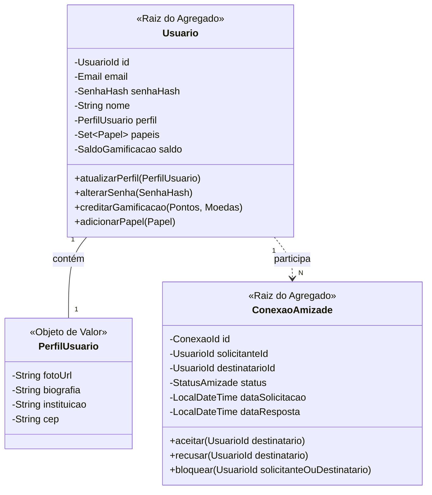

# 🔐 Contexto de Identidade (Identity Context) — Especificação Tática de Domínio

O **Contexto de Identidade** é um **Subdomínio de Suporte** (Supporting Subdomain) responsável pelo gerenciamento seguro do ciclo de vida das credenciais, perfis sociais institucionais, papéis de acesso (`ROLE_ALUNO`, `ROLE_PROFESSOR`) e o grafo de conexões/amizades entre os acadêmicos.

---

## 🎯 Escopo do Contexto e Linguagem Ubíqua

* **Linguagem Ubíqua do Contexto:**
  * **`Usuario`:** Agregado raiz que representa o membro cadastrado no ecossistema, detentor de credenciais e saldo de gamificação.
  * **`ConexaoAmizade`:** Agregado que encapsula o estado e o histórico do relacionamento bidirecional entre dois usuários.
  * **`PerfilUsuario`:** Objeto de valor que agrupa a apresentação pública do usuário (biografia, foto, links e instituição).
  * **`SenhaHash`:** Objeto de valor imutável que garante que senhas em texto puro nunca existam no modelo de domínio.
  * **`Email`:** Objeto de valor imutável com autovalidação sintática de endereço de correio eletrônico.

---

## 🏗️ Design Tático: Agregados, Raízes e Fronteiras Transacionais



---

### 1. Agregado: `Usuario`

#### **Fronteira do Agregado:**
* **Raiz do Agregado (`Aggregate Root`):** `Usuario`
* **Value Objects:** `UsuarioId`, `Email`, `SenhaHash`, `PerfilUsuario`, `SaldoGamificacao`, `Papel` (Enum: `ROLE_ALUNO`, `ROLE_PROFESSOR`, `ROLE_ADMIN`)

#### **Invariantes e Regras de Negócio Inegociáveis:**
1. **Unicidade de E-mail:** O Value Object `Email` garante sintaxe RFC 5322 e o repositório garante unicidade no sistema no momento do cadastro.
2. **Encapsulamento de Hash de Senha:** O domínio aceita apenas instâncias de `SenhaHash` geradas pela porta `PasswordHasherPort`. Nenhuma string em texto plano é armazenada no modelo.
3. **Não-Negatividade de Gamificação:** O `SaldoGamificacao` impede débitos que resultem em saldo negativo de pontos ou moedas acadêmicas.
4. **Mínimo de um Papel:** Todo usuário deve possuir ao menos um `Papel` ativo.

---

### 2. Agregado: `ConexaoAmizade`

#### **Fronteira do Agregado:**
* **Raiz do Agregado (`Aggregate Root`):** `ConexaoAmizade`
* **Value Objects:** `ConexaoId`, `UsuarioId` (Solicitante), `UsuarioId` (Destinatário), `StatusAmizade` (Enum: `PENDENTE`, `ACEITO`, `RECUSADO`, `BLOQUEADO`)

#### **Invariantes e Regras de Negócio Inegociáveis:**
1. **Impossibilidade de Auto-Conexão:** O `solicitanteId` deve obrigatoriamente ser diferente do `destinatarioId`. Tentar conectar um usuário a si mesmo dispara `AutoConexaoInvalidaException`.
2. **Máquina de Estados de Amizade:**
   * A conexão inicia estritamente no estado `PENDENTE`.
   * Apenas o `destinatarioId` tem autoridade para executar `aceitar()` ou `recusar()`.
   * O método `aceitar()` altera o estado para `ACEITO` e registra a `dataResposta`.
3. **Prevenção de Duplicidade:** O repositório valida que não existe outra `ConexaoAmizade` ativa entre o mesmo par de usuários (em qualquer direção).

---

## 💎 Objetos de Valor (Value Objects) Ricos

```java
// Exemplo de Especificação do Value Object Email
public final record Email(String endereco) {
    private static final Pattern EMAIL_PATTERN = 
        Pattern.compile("^[A-Za-z0-9+_.-]+@(.+)$");

    public Email {
        if (endereco == null || !EMAIL_PATTERN.matcher(endereco).matches()) {
            throw new EmailInvalidoException("Endereço de e-mail malformado: " + endereco);
        }
    }
}
```

* **`PerfilUsuario`:** Imutável. Valida formato de URLs de foto e limita extensão da biografia (máx 500 caracteres).
* **`SaldoGamificacao`:** Objeto de valor contendo `pontos` e `moedas` com métodos imutáveis para acréscimo (`adicionar(pontos)` retornando nova instância).

---

## 🔔 Eventos de Domínio (Domain Events)

1. **`UsuarioCadastradoEvent`**
   * *Payload:* `UsuarioId`, `Email`, `Nome`, `Papel`, `OccurredOn`.
   * *Consumidores:* `Notification Context` (e-mail de boas-vindas).
2. **`SolicitacaoAmizadeEnviadaEvent`**
   * *Payload:* `ConexaoId`, `SolicitanteId`, `DestinatarioId`, `OccurredOn`.
   * *Consumidores:* `Notification Context` (notificação push/in-app).
3. **`AmizadeAceitaEvent`**
   * *Payload:* `ConexaoId`, `SolicitanteId`, `DestinatarioId`, `OccurredOn`.
   * *Consumidores:* `Social Context` (liberar visibilidade de postagens privadas no feed).

---

## 🛠️ Domain Services (Serviços de Domínio)

* **`AutenticacaoDomainService`:**
  * **Responsabilidade:** Validar credenciais fornecidas contra o `Usuario` e orquestrar login social OAuth2 (Google/Facebook).
  * **Assinatura:** `Usuario autenticar(Email email, String senhaPura, PasswordHasherPort hasher)`.

* **`VerificacaoElegibilidadeAmizadeService`:**
  * **Responsabilidade:** Validar se dois usuários não possuem bloqueio mútuo antes de permitir nova solicitação.

---

## 🔌 Outbound Ports (Contratos de Infraestrutura)

Interfaces declaradas na camada `domain.ports`:

```java
public interface UsuarioRepository {
    Usuario save(Usuario usuario);
    Optional<Usuario> findById(UsuarioId id);
    Optional<Usuario> findByEmail(Email email);
    boolean existsByEmail(Email email);
}

public interface ConexaoAmizadeRepository {
    ConexaoAmizade save(ConexaoAmizade conexao);
    Optional<ConexaoAmizade> findById(ConexaoId id);
    Optional<ConexaoAmizade> findEntreUsuarios(UsuarioId u1, UsuarioId u2);
    List<ConexaoAmizade> findAmizadesAceitas(UsuarioId usuarioId);
}

public interface PasswordHasherPort {
    SenhaHash hash(String senhaPura);
    boolean matches(String senhaPura, SenhaHash hashExistente);
}

public interface PostagemRepository {
    Postagem save(Postagem postagem);
    Optional&lt;Postagem&gt; findById(PostagemId id);
    List&lt;Postagem&gt; findFeedParaUsuario(UsuarioId usuarioId);
}

public interface ComentarioRepository {
    Comentario save(Comentario comentario);
    Optional&lt;Comentario&gt; findById(ComentarioId id);
    List&lt;Comentario&gt; findComentariosParaPostagem(PostagemId postagemId);
}

public interface InteracaoUsuarioRepository {
    InteracaoUsuario save(InteracaoUsuario interacao);
    Optional&lt;InteracaoUsuario&gt; findById(InteracaoUsuarioId id);
    List&lt;InteracaoUsuario&gt; findInteracoesParaUsuario(UsuarioId usuarioId);
}
```

