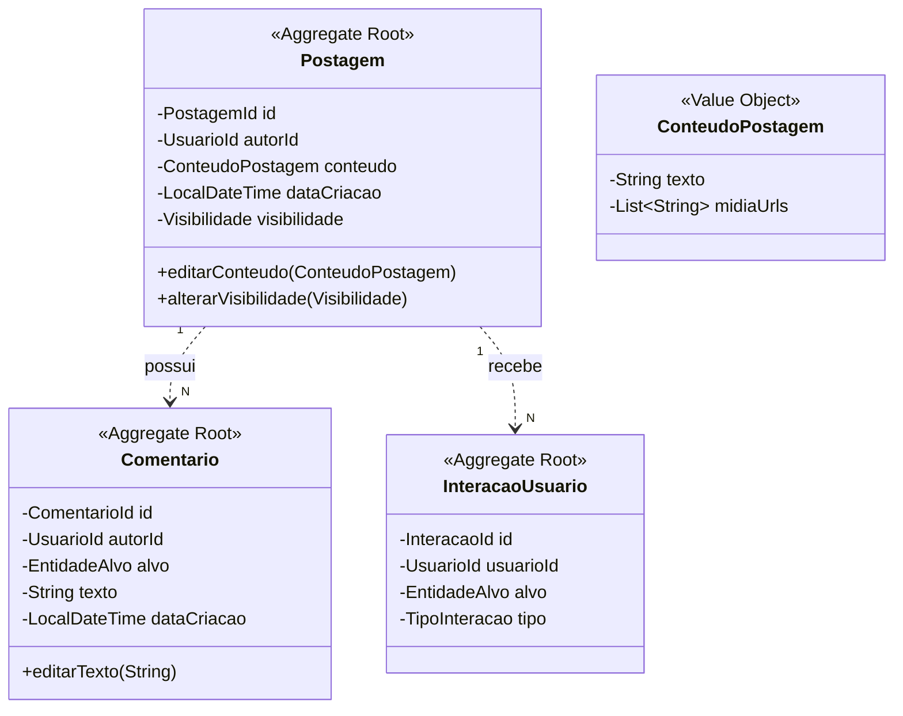

# 📱 Contexto Social (Social Context) — Especificação Tática de Domínio

O **Contexto Social** é um **Subdomínio de Suporte** (Supporting Subdomain) responsável por promover o engajamento e a interação entre os membros da comunidade acadêmica, permitindo o compartilhamento de conhecimento e interações sociais.

---

## 🎯 Escopo do Contexto e Linguagem Ubíqua

* **Linguagem Ubíqua do Contexto:**
  * **`Postagem`**: Agregado raiz que representa o conteúdo compartilhado por um usuário no feed.
  * **`Comentario`**: Agregado que representa uma resposta textual a uma `Postagem` ou `Atividade`.
  * **`InteracaoUsuario`**: Agregado que registra uma ação de engajamento rápido (ex: `Curtida`).
  * **`ConteudoPostagem`**: Objeto de valor que encapsula o texto da postagem com validação de integridade e tamanho.
  * **`EntidadeAlvo`**: Objeto de valor que identifica de forma polimórfica o alvo de uma interação ou comentário (Postagem ou Atividade).

---

## 🏗️ Design Tático: Agregados, Raízes e Fronteiras Transacionais



---

### 1. Agregado: `Postagem`

#### **Fronteira do Agregado:**
* **Raiz do Agregado (`Aggregate Root`):** `Postagem`
* **Value Objects:** `PostagemId`, `UsuarioId`, `ConteudoPostagem`, `Visibilidade` (Enum: `PUBLICO`, `AMIGOS`)

#### **Invariantes e Regras de Negócio Inegociáveis:**
1. **Conteúdo Obrigatório:** Uma postagem não pode ser instanciada sem um `ConteudoPostagem` válido.
2. **Autoridade de Edição:** Apenas o `autorId` original possui permissão para invocar `editarConteudo()` ou `alterarVisibilidade()`.
3. **Imutabilidade da Data:** A `dataCriacao` é definida no momento da persistência inicial e nunca mais alterada.

---

### 2. Agregado: `Comentario`

#### **Fronteira do Agregado:**
* **Raiz do Agregado (`Aggregate Root`):** `Comentario`
* **Value Objects:** `ComentarioId`, `UsuarioId`, `EntidadeAlvo` (Polimórfico: `POSTAGEM`, `ATIVIDADE`)

#### **Invariantes e Regras de Negócio Inegociáveis:**
1. **Integridade do Alvo:** O `Comentario` deve obrigatoriamente referenciar um `EntidadeAlvo` existente e válido.
2. **Limite de Extensão:** O texto do comentário deve respeitar o limite de 1000 caracteres definido no domínio.

---

### 3. Agregado: `InteracaoUsuario`

#### **Fronteira do Agregado:**
* **Raiz do Agregado (`Aggregate Root`):** `InteracaoUsuario`
* **Value Objects:** `InteracaoId`, `UsuarioId`, `EntidadeAlvo`, `TipoInteracao` (Enum: `CURTIDA`, `COMPARTILHAMENTO`)

#### **Invariantes e Regras de Negócio Inegociáveis:**
1. **Unicidade de Interação:** Um `UsuarioId` não pode registrar mais de uma interação do mesmo `TipoInteracao` para o mesmo `EntidadeAlvo`. (Ex: Apenas um "Like" por postagem).

---

## 💎 Objetos de Valor (Value Objects) Ricos

* **`ConteudoPostagem`**: Valida se o texto contém palavras proibidas (moderação automática básica) e se o tamanho está entre 1 e 5000 caracteres.
* **`EntidadeAlvo`**: Encapsula o ID da entidade e o tipo (ex: `targetId: 123, type: ATIVIDADE`).

---

## 🔔 Eventos de Domínio (Domain Events)

1. **`PostagemCriadaEvent`**
   * *Payload:* `PostagemId`, `AutorId`, `Visibilidade`, `OccurredOn`.
   * *Consumidores:* `Notification Context` (notificar seguidores/amigos).
2. **`ComentarioAdicionadoEvent`**
   * *Payload:* `ComentarioId`, `AlvoId`, `AlvoTipo`, `AutorId`, `OccurredOn`.
   * *Consumidores:* `Notification Context` (notificar autor da postagem ou docente da atividade).
3. **`InteracaoRegistradaEvent`**
   * *Payload:* `InteracaoId`, `AlvoId`, `UsuarioId`, `Tipo`, `OccurredOn`.
   * *Consumidores:* `Identity Context` (atribuir pontos de engajamento social).

---

## 🛠️ Domain Services (Serviços de Domínio)

* **`FeedOrchestratorService`**:
  * **Responsabilidade**: Orquestrar a montagem do feed personalizado, filtrando postagens por visibilidade e amizade (consultando o `Identity Context` via ACL).
* **`ModeracaoConteudoService`**:
  * **Responsabilidade**: Validar se o conteúdo da postagem ou comentário viola diretrizes da comunidade acadêmica.

---

## 🔌 Outbound Ports (Contratos de Infraestrutura)

```java
public interface PostagemRepository {
    Postagem save(Postagem postagem);
    Optional<Postagem> findById(PostagemId id);
    List<Postagem> findByAutorId(UsuarioId autorId);
    void delete(PostagemId id);
}

public interface ComentarioRepository {
    Comentario save(Comentario comentario);
    List<Comentario> findAllByAlvo(EntidadeAlvo alvo);
}

public interface SocialIdentityPort {
    boolean saoAmigos(UsuarioId u1, UsuarioId u2);
    List<UsuarioId> buscarAmigos(UsuarioId usuarioId);
}
```
