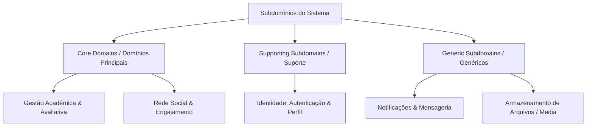
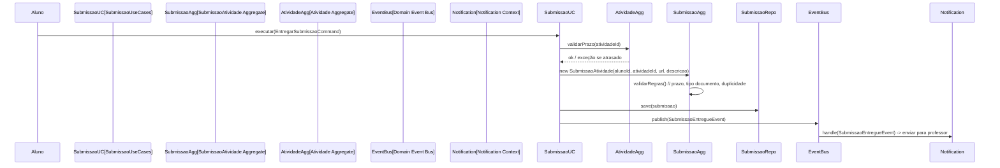
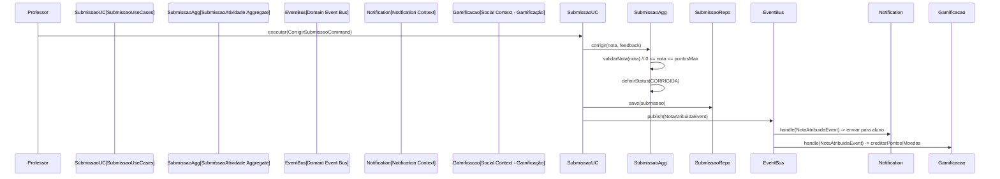

# 🏗️ Documentação de Arquitetura e Strategic Domain-Driven Design (DDD) - Plataforma Acadêmica

Este documento estabelece a especificação arquitetural de alto nível baseada em **Domain-Driven Design (DDD)** para a Plataforma Acadêmica Integrada. Ele define a divisão estratégica de domínios, a delimitação de contextos (**Bounded Contexts**), o **Context Map** (Mapa de Contextos), os padrões de integração e a linguagem ubíqua global da aplicação.

---

## 🎯 Visão Estratégica do Domínio

O domínio de negócio da aplicação é o **Ecossistema de Aprendizagem e Engajamento Acadêmico Colaborativo**. O propósito fundamental do sistema é maximizar o desempenho acadêmico, a gestão pedagógica e a retenção do aluno por meio da integração harmônica entre gestão de salas de aula virtuais, avaliação contínua e redes sociais acadêmicas.

---

## 🗺️ Taxonomia e Mapeamento de Subdomínios

Para gerenciar a complexidade do software e focar os recursos de engenharia onde existe o maior diferencial competitivo, o domínio é dividido em três categorias estratégicas de subdomínios:



### 1. Core Domains (Domínios Principais)
*Representam a proposta de valor única do produto. Recebem a maior atenção técnica e refinamento de modelagem rica.*

* **A. Gestão Acadêmica e Avaliativa (`Academic Context`)**
  * **Foco:** Ciclo de vida completo das disciplinas virtuais, gestão de turmas, criação de tarefas com pontuação, controle de prazos, submissão de trabalhos, correção, atribuição de notas e feedback.
  * **Diferencial:** Regras complexas de validação temporal (prazos), fluxo de estados de submissão (pendente → recebida → corrigida), cálculo de médias e relatórios de desempenho.
  * **Investimento:** Modelagem tática rica (Agregados, Value Objects, Domain Events, Policies).

* **B. Rede Social e Engajamento (`Social Context`)**
  * **Foco:** Feed de postagens, comentários polimórficos (em postagens, atividades, salas), curtidas, comunidades temáticas, amizades/conexões, gamificação (pontos, moedas, níveis).
  * **Diferencial:** Algoritmos de recomendação, moderação de conteúdo, engajamento cross-context (social ↔ acadêmico).
  * **Investimento:** Modelagem tática rica, Event Sourcing para feed, CQRS para consultas de performance.

### 2. Supporting Subdomains (Subdomínios de Suporte)
*Necessários para o funcionamento dos Core Domains, mas não são o diferencial competitivo. Podem usar soluções prontas ou modelagem mais simples.*

* **C. Identidade, Autenticação e Perfil (`Identity Context`)**
  * **Foco:** Cadastro, login (OAuth2/JWT), roles (`ROLE_ALUNO`, `ROLE_PROFESSOR`, `ROLE_ADMIN`), perfil público (bio, avatar, instituição), gestão de senhas, recuperação de conta.
  * **Estratégia:** Integração com Spring Security + OAuth2. Modelo anêmico aceitável (CRUD). Anti-Corruption Layer para expor apenas `UsuarioId` e `Papel` aos Core Domains.

### 3. Generic Subdomains (Subdomínios Genéricos)
*Problemas resolvidos universalmente. Comprar/usar bibliotecas prontas.*

* **D. Notificações e Mensageria (`Notification Context`)**
  * **Foco:** Push, e-mail, in-app, WebSocket (tempo real). Template de mensagens.
  * **Estratégia:** Biblioteca pronta / Serviço gerenciado.

* **E. Armazenamento de Arquivos e Mídia (`Storage Context`)**
  * **Foco:** Upload, download, CDN, assinatura de URLs, validação de tipo/tamanho.
  * **Estratégia:** S3/MinIO + biblioteca cliente.

---

## 🧭 Bounded Contexts (Contextos Delimitados)

Cada contexto abaixo possui seu próprio modelo de domínio, linguagem ubíqua, banco de dados (schema lógico) e equipe responsável.

| Contexto | Tipo | Responsabilidade Principal | Modelo de Dados |
|----------|------|---------------------------|-----------------|
| **Academic Context** | Core | Salas de Aula, Atividades, Submissões, Notas, Frequência | `sala_de_aula`, `atividade`, `submissaoatividade`, `frequencia` |
| **Social Context** | Core | Postagens, Comentários, Curtidas, Comunidades, Amizades, Gamificação | `postagem`, `comentarios`, `curtida`, `comunidades`, `amizades`, `interacao_usuario` |
| **Identity Context** | Supporting | Usuários, Perfis, Autenticação, Papéis, Conexões | `usuario`, `perfil`, `amizades` (shared kernel) |
| **Notification Context** | Generic | Notificações push, e-mail, WebSocket, templates | `notificacao` |
| **Storage Context** | Generic | Arquivos, avatars, documentos, mídia | Buckets S3/MinIO |

---

## 🔗 Context Map (Mapa de Contextos)

```mermaid
graph LR
    Academic[Academic Context\nCore Domain] -->|ACL / Domain Events| Identity[Identity Context\nSupporting]
    Social[Social Context\nCore Domain] -->|ACL / Domain Events| Identity
    Academic -->|Domain Events| Notification[Notification Context\nGeneric]
    Social -->|Domain Events| Notification
    Academic -->|ACL| Storage[Storage Context\nGeneric]
    Social -->|ACL| Storage
    Identity -->|Shared Kernel\n(UsuarioId, Papel)| Academic
    Identity -->|Shared Kernel\n(UsuarioId, Papel)| Social
```

### Padrões de Integração Utilizados

| Origem → Destino | Padrão | Justificativa |
|------------------|--------|---------------|
| Academic → Identity | **ACL (Anti-Corruption Layer)** | Academic não conhece detalhes de senha/OAuth; consome apenas `UsuarioId` e `Papel` via interface `UsuarioProvider` |
| Social → Identity | **ACL** | Mesma razão; Social consome `PerfilUsuario` (VO) via `PerfilProvider` |
| Academic → Notification | **Domain Events** | `SubmissaoEntregueEvent`, `NotaAtribuidaEvent` → Notification reage assincronamente |
| Social → Notification | **Domain Events** | `PostagemCriadaEvent`, `ComentarioAdicionadoEvent`, `CurtidaRegistradaEvent` |
| Academic/Social → Storage | **ACL** | `DocumentoStoragePort` / `AvatarStoragePort` — abstração sobre S3/MinIO |
| Identity ↔ Academic/Social | **Shared Kernel** | Apenas `UsuarioId` (Value Object) e `Papel` (Enum) compartilhados; zero dependência de JPA/Entidades |

---

## 🌐 Linguagem Ubíqua Global (Glossário Unificado)

| Termo | Contexto | Definição |
|-------|----------|-----------|
| **UsuarioId** | Shared Kernel | Identificador único e imutável de um acadêmico (Long/UUID) |
| **Papel** | Shared Kernel | `ALUNO`, `PROFESSOR`, `ADMIN` — define capacidades no sistema |
| **SalaDeAula** | Academic | Agregado raiz: ambiente virtual de uma disciplina/turma |
| **CodigoSala** | Academic | VO: Chave alfanumérica de 8 chars para ingresso (ex: `A7X9K2M5`) |
| **Atividade** | Academic | Agregado raiz: tarefa avaliativa com prazo, pontuação, tipo de entrega |
| **SubmissaoAtividade** | Academic | Agregado raiz: entrega do aluno + correção/nota/feedback do professor |
| **Nota** | Academic | VO: Valor numérico validado contra `PontuacaoMaxima` da atividade |
| **Postagem** | Social | Agregado raiz: conteúdo compartilhado no feed (texto/imagem) |
| **Comentario** | Social | Entidade polimórfica: discussão em Postagem, Atividade ou SalaDeAula |
| **Curtida** | Social | VO/Entidade: Interação `LIKE` em Postagem ou Comentario |
| **Comunidade** | Social | Agregado raiz: Grupo temático com dono, membros e papéis |
| **Amizade** | Identity/Social | Agregado: Conexão bidirecional `PENDENTE` → `ACEITO`/`RECUSADO` |
| **Gamificacao** | Social | VO: `Pontos`, `Moedas`, `Nivel` (Bronze/Prata/Ouro/Platina/Diamante) |
| **Notificacao** | Notification | Entidade: Aviso assíncrono com template, canal, status de leitura |

---

## 🏛️ Princípios Arquiteturais (Constituição do Projeto)

1. **Domain Isolation**: Camada `domain` (pacote `model` + `service` interfaces) **zero dependências** de Spring, JPA, Hibernate, Controllers, DTOs.
2. **Rich Domain Model**: Entidades e Agregados expõem **métodos de negócio expressivos** (`publicar()`, `corrigir(nota, feedback)`, `aceitar()`), não getters/setters anêmicos.
3. **Value Objects para Validação**: `Email`, `SenhaHash`, `CodigoSala`, `Nota`, `UrlDocumento` — autovalidação no construtor/factory.
4. **Aggregate Consistency**: Invariantes garantidas **dentro** da fronteira do Agregado (transação única).
5. **Domain Events para Consistência Eventual**: Cruzamento de contextos via eventos (`SubmissaoEntregue`, `AmizadeAceita`).
6. **Repository Interfaces no Domínio**: `SalaDeAulaRepository`, `AtividadeRepository` — implementação em `infrastructure/persistence`.
7. **Application Services (Use Cases)**: Orquestram Agregados, Repositories, Domain Events, ACLs — **não contêm regras de negócio**.
8. **CQRS Leve**: Commands (escrita) via Application Services; Queries (leitura) via Projections/DTOs otimizados.
9. **Testabilidade**: Domain puro testável sem Spring, sem BD (unitários em ms). Integration tests apenas para adapters.

---

## 📦 Estrutura de Pacotes Sugerida (Clean/Hexagonal)

```
com.plataforma_academica.plataforma
├── academiccontext                    # Academic Context (Core)
│   ├── domain
│   │   ├── model                      # Agregados, Entidades, VOs, Enums, Domain Events
│   │   │   ├── sala
│   │   │   │   ├── SalaDeAula.java
│   │   │   │   ├── CodigoSala.java
│   │   │   │   ├── MembroSala.java
│   │   │   │   └── PapelSala.java
│   │   │   ├── atividade
│   │   │   │   ├── Atividade.java
│   │   │   │   ├── PrazoEntrega.java
│   │   │   │   ├── Pontuacao.java
│   │   │   │   └── StatusAtividade.java
│   │   │   ├── submissao
│   │   │   │   ├── SubmissaoAtividade.java
│   │   │   │   ├── Nota.java
│   │   │   │   ├── Feedback.java
│   │   │   │   └── StatusSubmissao.java
│   │   │   ├── frequencia
│   │   │   │   ├── Frequencia.java
│   │   │   │   └── StatusFrequencia.java
│   │   │   └── events
│   │   │       ├── SubmissaoEntregueEvent.java
│   │   │       ├── NotaAtribuidaEvent.java
│   │   │       └── SalaEncerradaEvent.java
│   │   ├── repository                 # Interfaces (Ports)
│   │   │   ├── SalaDeAulaRepository.java
│   │   │   ├── AtividadeRepository.java
│   │   │   ├── SubmissaoAtividadeRepository.java
│   │   │   └── FrequenciaRepository.java
│   │   └── service                    # Domain Services (estateless, regras cross-aggregate)
│   │       ├── CalculoMediaService.java
│   │       └── ValidacaoPrazoService.java
│   ├── application                    # Use Cases (Application Services)
│   │   ├── SalaDeAulaUseCases.java
│   │   ├── AtividadeUseCases.java
│   │   ├── SubmissaoUseCases.java
│   │   └── dto                        # Command/Query DTOs
│   └── infrastructure
│       ├── persistence                # JPA Repositories + Mappers
│       │   ├── jpa
│       │   │   ├── SalaDeAulaJpaRepository.java
│       │   │   ├── SalaDeAulaEntity.java
│       │   │   └── SalaDeAulaMapper.java
│       │   └── ...
│       └── acl                        # Anti-Corruption Layers
│           ├── UsuarioProvider.java
│           └── UsuarioProviderImpl.java
│
├── socialcontext                      # Social Context (Core)
│   ├── domain
│   │   ├── model
│   │   │   ├── postagem
│   │   │   │   ├── Postagem.java
│   │   │   │   └── ImagemUrl.java
│   │   │   ├── comentario
│   │   │   │   ├── Comentario.java
│   │   │   │   ├── TipoDestinoComentario.java
│   │   │   │   └── ConteudoComentario.java
│   │   │   ├── curtida
│   │   │   │   ├── Curtida.java
│   │   │   │   └── TipoInteracao.java
│   │   │   ├── comunidade
│   │   │   │   ├── Comunidade.java
│   │   │   │   ├── MembroComunidade.java
│   │   │   │   └── PapelComunidade.java
│   │   │   ├── amizade
│   │   │   │   ├── Amizade.java
│   │   │   │   └── StatusAmizade.java
│   │   │   ├── gamificacao
│   │   │   │   ├── Gamificacao.java
│   │   │   │   ├── Pontos.java
│   │   │   │   ├── Moedas.java
│   │   │   │   └── Nivel.java
│   │   │   └── events
│   │   │       ├── PostagemCriadaEvent.java
│   │   │       ├── ComentarioAdicionadoEvent.java
│   │   │       └── CurtidaRegistradaEvent.java
│   │   ├── repository
│   │   └── service
│   ├── application
│   └── infrastructure
│
├── identitycontext                    # Identity Context (Supporting)
│   ├── domain
│   │   ├── model
│   │   │   ├── usuario
│   │   │   │   ├── Usuario.java
│   │   │   │   ├── Email.java
│   │   │   │   ├── SenhaHash.java
│   │   │   │   ├── Papel.java
│   │   │   │   └── UsuarioId.java
│   │   │   ├── perfil
│   │   │   │   ├── PerfilUsuario.java
│   │   │   │   ├── Bio.java
│   │   │   │   └── AvatarUrl.java
│   │   │   └── conexao
│   │   │       ├── ConexaoAmizade.java
│   │   │       └── StatusConexao.java
│   │   ├── repository
│   │   └── service
│   ├── application
│   └── infrastructure
│
├── notificationcontext                # Notification Context (Generic)
│   ├── domain
│   ├── application
│   └── infrastructure
│
├── storagecontext                     # Storage Context (Generic)
│   ├── domain
│   ├── application
│   └── infrastructure
│
├── sharedkernel                       # Shared Kernel (apenas VOs/Enums/Interfaces)
│   ├── UsuarioId.java
│   ├── Papel.java
│   ├── DomainEvent.java
│   └── ValueObject.java
│
└── config                             # Configuração global (Spring, Security, etc.)
    ├── SecurityConfig.java
    ├── WebConfig.java
    └── ...
```

---

## 🔄 Fluxos Principais de Negócio (Domain Events)

### Fluxo: Entrega de Atividade pelo Aluno


### Fluxo: Correção pelo Professor


---

## ✅ Checklist de Conformidade DDD (Quality Gate)

| Critério | Status | Observação |
|----------|--------|------------|
| Camada `domain` isolada de frameworks | ⚠️ Parcial | Atualmente modelos usam `@Entity`, `@Data` (Lombok) — **precisa migrar para POJOs puros** |
| Agregados com métodos de negócio expressivos | ❌ Não | Modelos atuais são anêmicos (getters/setters) — **refatorar para Rich Model** |
| Value Objects imutáveis com validação | ❌ Não | `Email`, `CodigoSala`, `Nota` não existem como VOs — **criar** |
| Domain Events para cross-context | ❌ Não | Comunicação direta via repositórios — **implementar Event Bus** |
| Repositories como interfaces no domínio | ⚠️ Parcial | Interfaces existem mas no pacote `repository` misturado com JPA — **mover para `domain/repository`** |
| ACLs para contextos externos | ❌ Não | Acesso direto a `Usuario` JPA — **criar `UsuarioProvider` interface** |
| Application Services (Use Cases) | ❌ Não | Lógica em `ServiceImpl` misturada com infra — **separar em `application`** |
| CQRS para consultas complexas | ❌ Não | Consultas via repositórios JPA — **criar Projections/Read Models** |
| Testes unitários de domínio puros | ❌ Não | Testes atuais sobem Spring Context — **refatorar para testes puros** |

---

## 🚀 Próximos Passos (Roadmap de Migração)

### Fase 1: Fundação (Semanas 1-2)
- [ ] Criar pacote `sharedkernel` com `UsuarioId`, `Papel`, `DomainEvent`, `ValueObject`
- [ ] Extrair `Email`, `SenhaHash`, `CodigoSala`, `Nota`, `UrlDocumento` como Value Objects
- [ ] Definir interfaces `Repository` no pacote `domain/repository` de cada contexto

### Fase 2: Rich Domain Model - Academic Context (Semanas 3-5)
- [ ] Refatorar `SalaDeAula`, `Atividade`, `SubmissaoAtividade` como Agregados ricos
- [ ] Implementar `Domain Events`: `SubmissaoEntregue`, `NotaAtribuida`, `SalaEncerrada`
- [ ] Criar `Application Services` (Use Cases) para comandos de escrita
- [ ] Implementar `UsuarioProvider` (ACL) para Identity Context

### Fase 3: Rich Domain Model - Social Context (Semanas 6-8)
- [ ] Refatorar `Postagem`, `Comentario`, `Comunidade`, `Amizade` como Agregados ricos
- [ ] Implementar `Domain Events`: `PostagemCriada`, `ComentarioAdicionado`, `CurtidaRegistrada`, `AmizadeAceita`
- [ ] Criar `Application Services` para comandos sociais
- [ ] Implementar `PerfilProvider` (ACL) para Identity Context

### Fase 4: Identity Context & Integração (Semanas 9-10)
- [ ] Refatorar `Usuario`, `PerfilUsuario`, `ConexaoAmizade` com VOs
- [ ] Implementar `UsuarioProviderImpl` e `PerfilProviderImpl` (adapters JPA)
- [ ] Configurar Event Bus (Spring ApplicationEventPublisher ou Axon/Eventuate)

### Fase 5: Infraestrutura & Testes (Semanas 11-12)
- [ ] Migrar repositórios JPA para `infrastructure/persistence/jpa`
- [ ] Criar Mappers (Entity ↔ Domain) — **zero lógica de negócio**
- [ ] Escrever testes unitários puros de domínio (sem Spring)
- [ ] Configurar TestContainers para testes de integração de adapters

---

## 📚 Referências e Leituras Recomendadas

1. **Eric Evans** - *Domain-Driven Design: Tackling Complexity in the Heart of Software* (Blue Book)
2. **Vaughn Vernon** - *Implementing Domain-Driven Design* (Red Book)
3. **Vaughn Vernon** - *Domain-Driven Design Distilled* (Visão geral concisa)
4. **Scott Millett & Nick Tune** - *Patterns, Principles, and Practices of Domain-Driven Design*
5. **Martin Fowler** - *Patterns of Enterprise Application Architecture* (Repository, Unit of Work, etc.)
6. **Alberto Brandolini** - *Event Storming* (Workshop para descoberta de domínios)
7. **Spring Modulith** - Documentação oficial para modularização e verificação de arquitetura

---

*Documento versão 1.0 — Agosto 2026 — Plataforma Acadêmica Integrada*