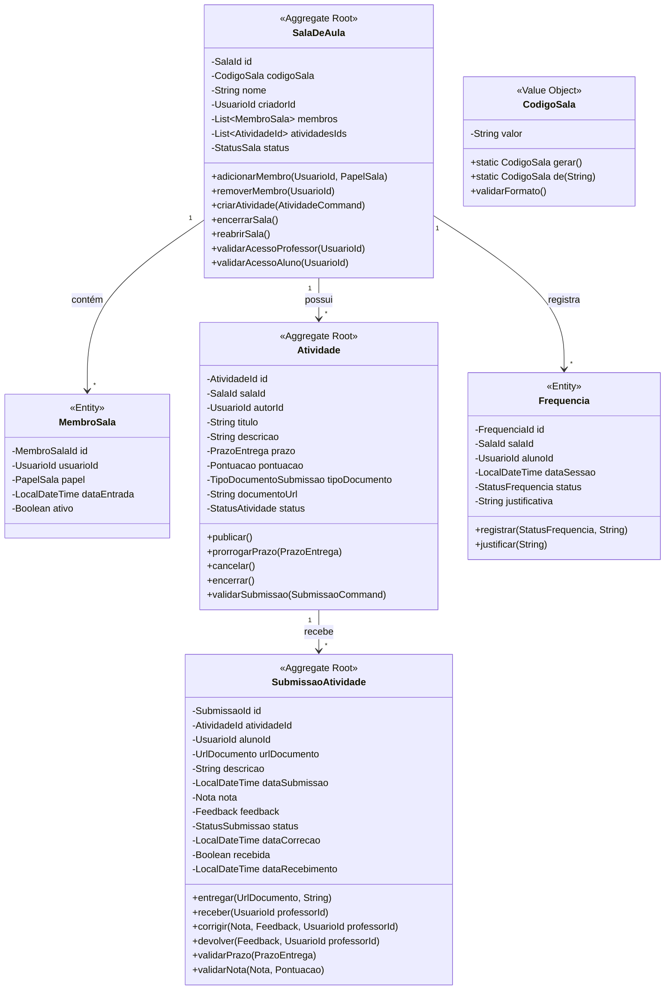

# 🎓 Contexto Acadêmico (Academic Context) — Especificação Tática de Domínio

O **Contexto Acadêmico** é o **Core Domain** (Domínio Principal) da Plataforma Acadêmica Integrada. Ele gerencia o ciclo de vida do processo de ensino-aprendizagem, englobando ambientes virtuais de aprendizagem, ciclo de tarefas avaliativas e o fluxo rigoroso de submissão, correção e atribuição de notas.

---

## 🎯 Escopo do Contexto e Linguagem Ubíqua

### Linguagem Ubíqua do Contexto

| Termo | Tipo | Definição |
|-------|------|-----------|
| **SalaDeAula** | Aggregate Root | Ambiente virtual de uma disciplina/turma, agrega membros e atividades |
| **CodigoSala** | Value Object | Chave alfanumérica imutável de 8 caracteres para ingresso (ex: `A7X9K2M5`) |
| **MembroSala** | Entity | Vinculo entre Usuario e SalaDeAula com papel (PROFESSOR/ALUNO) |
| **PapelSala** | Enum | `PROFESSOR`, `ALUNO` — define permissões dentro da sala |
| **Atividade** | Aggregate Root | Tarefa avaliativa com prazo, pontuação, tipo de entrega e status |
| **PrazoEntrega** | Value Object | Data/hora limite com validação de não-retroatividade |
| **Pontuacao** | Value Object | Valor numérico positivo (max 1000) representando peso da atividade |
| **StatusAtividade** | Enum | `RASCUNHO`, `PUBLICADA`, `ENCERRADA`, `CANCELADA` |
| **SubmissaoAtividade** | Aggregate Root | Entrega do aluno + correção/nota/feedback do professor |
| **Nota** | Value Object | Valor numérico validado: `0 <= nota <= pontuacaoMaxima` |
| **Feedback** | Value Object | Texto livre do professor (máx 5000 chars) |
| **StatusSubmissao** | Enum | `PENDENTE`, `ENTREGUE`, `RECEBIDA`, `CORRIGIDA`, `DEVOLVIDA` |
| **Frequencia** | Entity | Registro de presença do aluno em sessão da sala |
| **StatusFrequencia** | Enum | `PRESENTE`, `AUSENTE`, `JUSTIFICADA` |

---

## 🏗️ Design Tático: Agregados, Raízes e Fronteiras Transacionais



---

## 📋 Regras de Negócio (Invariantes)

### SalaDeAula
1. **Criação**: Apenas usuários com `Papel.PROFESSOR` podem criar salas
2. **Código Único**: `CodigoSala` deve ser único globalmente (gerado automaticamente)
3. **Membros**: Um usuário não pode ser adicionado duas vezes à mesma sala
4. **Professor Único**: Apenas o criador (ou ADMIN) pode gerenciar a sala
5. **Encerramento**: Sala encerrada não aceita novas atividades nem submissões
6. **Reabertura**: Apenas ADMIN pode reabrir sala encerrada

### Atividade
1. **Publicação**: Só pode ser publicada se `prazo > agora()` e `pontuacao > 0`
2. **Prorrogação**: Novo prazo deve ser > prazo atual e > agora()
3. **Cancelamento**: Só permitido em `RASCUNHO` ou `PUBLICADA` sem submissões
4. **Encerramento**: Automático no prazo; manual pelo professor antecipa
5. **Validação de Submissão**: Verifica prazo, tipo de documento, duplicidade

### SubmissaoAtividade
1. **Entrega**: Só permitida se atividade `PUBLICADA` e `prazo >= agora()` (ou prorrogado)
2. **Tipo de Documento**: URL deve corresponder ao `tipoDocumentoSubmissao` da atividade
3. **Duplicidade**: Um aluno só pode ter uma submissão `ENTREGUE`/`RECEBIDA`/`CORRIGIDA` por atividade
4. **Recebimento**: Professor marca como `RECEBIDA` (confirma visualização)
5. **Correção**: 
   - `nota` deve ser `0 <= nota <= pontuacaoMaxima`
   - `feedback` obrigatório se `nota < pontuacaoMaxima * 0.7`
   - Transição: `RECEBIDA` → `CORRIGIDA`
6. **Devolução**: Professor devolve para nova tentativa: `CORRIGIDA` → `DEVOLVIDA` → `PENDENTE`

### Frequencia
1. **Registro**: Uma frequência por aluno por sessão (data/hora)
2. **Justificativa**: Obrigatória se `AUSENTE` ou `JUSTIFICADA`
3. **Permissão**: Apenas professor da sala ou ADMIN

---

## 🔄 Domain Events (Eventos de Domínio)

| Evento | Gatilho | Payload Principal | Consumidores |
|--------|---------|-------------------|--------------|
| `SalaCriadaEvent` | `SalaDeAula.criar()` | `salaId`, `codigoSala`, `criadorId`, `nome` | Notification, Social (recomendação) |
| `MembroAdicionadoEvent` | `SalaDeAula.adicionarMembro()` | `salaId`, `usuarioId`, `papel` | Notification, Identity |
| `AtividadePublicadaEvent` | `Atividade.publicar()` | `atividadeId`, `salaId`, `titulo`, `prazo`, `pontuacao` | Notification (alunos da sala) |
| `SubmissaoEntregueEvent` | `SubmissaoAtividade.entregar()` | `submissaoId`, `atividadeId`, `alunoId`, `dataSubmissao` | Notification (professor), Gamificação |
| `SubmissaoRecebidaEvent` | `SubmissaoAtividade.receber()` | `submissaoId`, `professorId` | Notification (aluno) |
| `NotaAtribuidaEvent` | `SubmissaoAtividade.corrigir()` | `submissaoId`, `nota`, `feedback`, `alunoId`, `atividadeId` | Notification (aluno), Gamificação, Relatórios |
| `SubmissaoDevolvidaEvent` | `SubmissaoAtividade.devolver()` | `submissaoId`, `feedback`, `alunoId` | Notification (aluno) |
| `SalaEncerradaEvent` | `SalaDeAula.encerrarSala()` | `salaId`, `criadorId` | Notification, Relatórios |

---

## 🔌 Ports (Interfaces de Repositório e Serviços)

### Repositories (Domain Layer)
```java
// academiccontext/domain/repository/SalaDeAulaRepository.java
public interface SalaDeAulaRepository {
    Optional<SalaDeAula> findById(SalaId id);
    Optional<SalaDeAula> findByCodigoSala(CodigoSala codigo);
    List<SalaDeAula> findByCriadorId(UsuarioId criadorId);
    List<SalaDeAula> findByMembroId(UsuarioId membroId);
    SalaDeAula save(SalaDeAula sala);
    void delete(SalaId id);
    boolean existsByCodigoSala(CodigoSala codigo);
}

// academiccontext/domain/repository/AtividadeRepository.java
public interface AtividadeRepository {
    Optional<Atividade> findById(AtividadeId id);
    List<Atividade> findBySalaId(SalaId salaId);
    List<Atividade> findByAutorId(UsuarioId autorId);
    List<Atividade> findByStatus(StatusAtividade status);
    Atividade save(Atividade atividade);
}

// academiccontext/domain/repository/SubmissaoAtividadeRepository.java
public interface SubmissaoAtividadeRepository {
    Optional<SubmissaoAtividade> findById(SubmissaoId id);
    Optional<SubmissaoAtividade> findByAtividadeIdAndAlunoId(AtividadeId atividadeId, UsuarioId alunoId);
    List<SubmissaoAtividade> findByAtividadeId(AtividadeId atividadeId);
    List<SubmissaoAtividade> findByAlunoId(UsuarioId alunoId);
    List<SubmissaoAtividade> findByStatus(StatusSubmissao status);
    SubmissaoAtividade save(SubmissaoAtividade submissao);
}

// academiccontext/domain/repository/FrequenciaRepository.java
public interface FrequenciaRepository {
    Optional<Frequencia> findById(FrequenciaId id);
    List<Frequencia> findBySalaIdAndDataSessao(SalaId salaId, LocalDateTime data);
    List<Frequencia> findByAlunoIdAndSalaId(UsuarioId alunoId, SalaId salaId);
    Frequencia save(Frequencia frequencia);
}
```

### Anti-Corruption Layer (ACL) - Identity Context
```java
// academiccontext/infrastructure/acl/UsuarioProvider.java
public interface UsuarioProvider {
    Optional<UsuarioInfo> findById(UsuarioId id);
    List<UsuarioInfo> findByIds(Set<UsuarioId> ids);
    boolean existsById(UsuarioId id);
    boolean hasPapel(UsuarioId id, Papel papel);
    
    record UsuarioInfo(UsuarioId id, String nome, String email, Papel papel, PerfilUsuario perfil) {}
    record PerfilUsuario(String bio, String avatarUrl, String instituicao) {}
}
```

### Domain Services (Estateless, Regras Cross-Aggregate)
```java
// academiccontext/domain/service/CalculoMediaService.java
public class CalculoMediaService {
    public MediaAluno calcularMedia(UsuarioId alunoId, SalaId salaId, List<SubmissaoAtividade> submissoes) {
        // Média ponderada por pontuação das atividades
    }
    
    public RelatorioDesempenho gerarRelatorio(SalaId salaId) {
        // Relatório consolidado da turma
    }
}

// academiccontext/domain/service/ValidacaoPrazoService.java
public class ValidacaoPrazoService {
    public boolean isPrazoValido(PrazoEntrega prazo) {
        return prazo.dataHora().isAfter(LocalDateTime.now());
    }
    
    public boolean isProrrogacaoValida(PrazoEntrega atual, PrazoEntrega novo) {
        return novo.dataHora().isAfter(atual.dataHora()) && novo.dataHora().isAfter(LocalDateTime.now());
    }
}
```

---

## 🎯 Application Services (Use Cases / Casos de Uso)

### SalaDeAulaUseCases
```java
// academiccontext/application/SalaDeAulaUseCases.java
@RequiredArgsConstructor
public class SalaDeAulaUseCases {
    private final SalaDeAulaRepository salaRepo;
    private final UsuarioProvider usuarioProvider;
    private final DomainEventPublisher eventPublisher;
    
    public SalaId criarSala(CriarSalaCommand cmd) {
        // 1. Validar professor
        usuarioProvider.hasPapel(cmd.criadorId(), Papel.PROFESSOR)
            .orElseThrow(() -> new DomainException("Apenas professores podem criar salas"));
        
        // 2. Criar agregado
        var sala = SalaDeAula.criar(cmd.nome(), cmd.criadorId());
        
        // 3. Persistir
        salaRepo.save(sala);
        
        // 4. Publicar evento
        eventPublisher.publish(new SalaCriadaEvent(sala.getId(), sala.getCodigoSala(), cmd.criadorId(), cmd.nome()));
        
        return sala.getId();
    }
    
    public void adicionarMembro(AdicionarMembroCommand cmd) {
        var sala = salaRepo.findById(cmd.salaId())
            .orElseThrow(() -> new NotFoundException("Sala não encontrada"));
        
        sala.adicionarMembro(cmd.usuarioId(), cmd.papel());
        salaRepo.save(sala);
        
        eventPublisher.publish(new MembroAdicionadoEvent(cmd.salaId(), cmd.usuarioId(), cmd.papel()));
    }
    
    public void encerrarSala(EncerrarSalaCommand cmd) {
        var sala = salaRepo.findById(cmd.salaId())
            .orElseThrow(() -> new NotFoundException("Sala não encontrada"));
        
        sala.validarAcessoProfessor(cmd.usuarioId());
        sala.encerrarSala();
        salaRepo.save(sala);
        
        eventPublisher.publish(new SalaEncerradaEvent(cmd.salaId(), cmd.usuarioId()));
    }
}
```

### AtividadeUseCases
```java
// academiccontext/application/AtividadeUseCases.java
@RequiredArgsConstructor
public class AtividadeUseCases {
    private final AtividadeRepository atividadeRepo;
    private final SalaDeAulaRepository salaRepo;
    private final DomainEventPublisher eventPublisher;
    
    public AtividadeId criarAtividade(CriarAtividadeCommand cmd) {
        var sala = salaRepo.findById(cmd.salaId())
            .orElseThrow(() -> new NotFoundException("Sala não encontrada"));
        
        sala.validarAcessoProfessor(cmd.professorId());
        
        var atividade = Atividade.criar(
            cmd.salaId(), cmd.professorId(), cmd.titulo(), cmd.descricao(),
            cmd.prazo(), cmd.pontuacao(), cmd.tipoDocumento(), cmd.documentoUrl()
        );
        
        atividadeRepo.save(atividade);
        sala.adicionarAtividade(atividade.getId());
        salaRepo.save(sala);
        
        return atividade.getId();
    }
    
    public void publicarAtividade(PublicarAtividadeCommand cmd) {
        var atividade = atividadeRepo.findById(cmd.atividadeId())
            .orElseThrow(() -> new NotFoundException("Atividade não encontrada"));
        
        atividade.publicar();
        atividadeRepo.save(atividade);
        
        eventPublisher.publish(new AtividadePublicadaEvent(
            atividade.getId(), atividade.getSalaId(), atividade.getTitulo(),
            atividade.getPrazo(), atividade.getPontuacao()
        ));
    }
}
```

### SubmissaoUseCases
```java
// academiccontext/application/SubmissaoUseCases.java
@RequiredArgsConstructor
public class SubmissaoUseCases {
    private final SubmissaoAtividadeRepository submissaoRepo;
    private final AtividadeRepository atividadeRepo;
    private final DomainEventPublisher eventPublisher;
    
    public SubmissaoId entregarSubmissao(EntregarSubmissaoCommand cmd) {
        var atividade = atividadeRepo.findById(cmd.atividadeId())
            .orElseThrow(() -> new NotFoundException("Atividade não encontrada"));
        
        // Validar se aluno já tem submissão ativa
        var existente = submissaoRepo.findByAtividadeIdAndAlunoId(cmd.atividadeId(), cmd.alunoId());
        if (existente.isPresent() && existente.get().getStatus().isAtiva()) {
            throw new DomainException("Já existe submissão ativa para esta atividade");
        }
        
        var submissao = SubmissaoAtividade.entregar(
            cmd.atividadeId(), cmd.alunoId(), cmd.urlDocumento(), cmd.descricao()
        );
        
        atividade.validarSubmissao(submissao);
        submissaoRepo.save(submissao);
        
        eventPublisher.publish(new SubmissaoEntregueEvent(
            submissao.getId(), cmd.atividadeId(), cmd.alunoId(), submissao.getDataSubmissao()
        ));
        
        return submissao.getId();
    }
    
    public void corrigirSubmissao(CorrigirSubmissaoCommand cmd) {
        var submissao = submissaoRepo.findById(cmd.submissaoId())
            .orElseThrow(() -> new NotFoundException("Submissão não encontrada"));
        
        var atividade = atividadeRepo.findById(submissao.getAtividadeId())
            .orElseThrow(() -> new NotFoundException("Atividade não encontrada"));
        
        // Validar permissão do professor
        // (via ACL ou verificação de sala)
        
        submissao.corrigir(cmd.nota(), cmd.feedback(), cmd.professorId());
        submissaoRepo.save(submissao);
        
        eventPublisher.publish(new NotaAtribuidaEvent(
            submissao.getId(), cmd.nota(), cmd.feedback(),
            submissao.getAlunoId(), submissao.getAtividadeId()
        ));
    }
}
```

---

## 🧪 Estratégia de Testes (Domain-First)

### Testes Unitários Puros (Sem Spring, Sem BD)
```java
// academiccontext/domain/model/submissao/SubmissaoAtividadeTest.java
class SubmissaoAtividadeTest {
    
    @Test
    void deveEntregarSubmissaoDentroDoPrazo() {
        // Given
        var atividadeId = AtividadeId.of(1L);
        var alunoId = UsuarioId.of(10L);
        var prazo = PrazoEntrega.de(LocalDateTime.now().plusDays(7));
        var atividade = AtividadeTestBuilder.umaAtividade()
            .comId(atividadeId)
            .comPrazo(prazo)
            .comPontuacao(Pontuacao.de(10.0))
            .publicada()
            .build();
        
        // When
        var submissao = SubmissaoAtividade.entregar(
            atividadeId, alunoId, 
            UrlDocumento.de("https://storage.com/doc.pdf"), 
            "Minha resolução"
        );
        
        // Then
        assertThat(submissao.getStatus()).isEqualTo(StatusSubmissao.ENTREGUE);
        assertThat(submissao.getDataSubmissao()).isBeforeOrEqualTo(LocalDateTime.now());
    }
    
    @Test
    void deveFalharEntregaAposPrazo() {
        var prazo = PrazoEntrega.de(LocalDateTime.now().minusDays(1)); // passado
        var atividade = AtividadeTestBuilder.umaAtividade()
            .comPrazo(prazo)
            .publicada()
            .build();
        
        assertThatThrownBy(() -> SubmissaoAtividade.entregar(...))
            .isInstanceOf(DomainException.class)
            .hasMessageContaining("Prazo expirado");
    }
    
    @Test
    void deveCorrigirComNotaValida() {
        var submissao = SubmissaoTestBuilder.umaSubmissao()
            .recebida()
            .build();
        
        submissao.corrigir(Nota.de(8.5), Feedback.de("Bom trabalho"), UsuarioId.of(99L));
        
        assertThat(submissao.getNota().valor()).isEqualTo(8.5);
        assertThat(submissao.getStatus()).isEqualTo(StatusSubmissao.CORRIGIDA);
    }
    
    @Test
    void deveFalharCorrigirComNotaAcimaDoMaximo() {
        var submissao = SubmissaoTestBuilder.umaSubmissao()
            .recebida()
            .build();
        var atividade = AtividadeTestBuilder.umaAtividade()
            .comPontuacao(Pontuacao.de(10.0))
            .build();
        
        assertThatThrownBy(() -> submissao.corrigir(Nota.de(11.0), ...))
            .isInstanceOf(DomainException.class)
            .hasMessageContaining("Nota não pode exceder pontuação máxima");
    }
}
```

---

## 📦 Value Objects - Especificação Detalhada

### CodigoSala
```java
public final class CodigoSala implements ValueObject {
    private static final int TAMANHO = 8;
    private static final String CHARS = "ABCDEFGHIJKLMNOPQRSTUVWXYZ0123456789";
    private final String valor;
    
    private CodigoSala(String valor) { this.valor = valor; }
    
    public static CodigoSala gerar() {
        var random = new SecureRandom();
        var sb = new StringBuilder(TAMANHO);
        for (int i = 0; i < TAMANHO; i++) {
            sb.append(CHARS.charAt(random.nextInt(CHARS.length())));
        }
        return new CodigoSala(sb.toString());
    }
    
    public static CodigoSala de(String valor) {
        if (valor == null || valor.length() != TAMANHO) {
            throw new IllegalArgumentException("Código deve ter 8 caracteres");
        }
        if (!valor.matches("[" + CHARS + "]{" + TAMANHO + "}")) {
            throw new IllegalArgumentException("Código deve conter apenas letras maiúsculas e números");
        }
        return new CodigoSala(valor.toUpperCase());
    }
    
    public String valor() { return valor; }
    
    @Override public boolean equals(Object o) { ... }
    @Override public int hashCode() { ... }
    @Override public String toString() { return valor; }
}
```

### Nota
```java
public final class Nota implements ValueObject {
    private final Double valor;
    
    private Nota(Double valor) { this.valor = valor; }
    
    public static Nota de(Double valor) {
        if (valor == null || valor < 0) {
            throw new IllegalArgumentException("Nota não pode ser negativa");
        }
        // Validação contra pontuação máxima feita no Agregado
        return new Nota(valor);
    }
    
    public Double valor() { return valor; }
    
    public boolean isAprovacao(Pontuacao pontuacaoMaxima) {
        return valor >= pontuacaoMaxima.valor() * 0.6; // 60% para aprovação
    }
    
    @Override public boolean equals(Object o) { ... }
    @Override public int hashCode() { ... }
}
```

### PrazoEntrega
```java
public final class PrazoEntrega implements ValueObject {
    private final LocalDateTime dataHora;
    
    private PrazoEntrega(LocalDateTime dataHora) { this.dataHora = dataHora; }
    
    public static PrazoEntrega de(LocalDateTime dataHora) {
        if (dataHora == null || dataHora.isBefore(LocalDateTime.now())) {
            throw new IllegalArgumentException("Prazo deve ser no futuro");
        }
        return new PrazoEntrega(dataHora);
    }
    
    public LocalDateTime dataHora() { return dataHora; }
    
    public boolean isExpirado() { return LocalDateTime.now().isAfter(dataHora); }
    public boolean isProximo(int horas) { return LocalDateTime.now().plusHours(horas).isAfter(dataHora); }
    
    @Override public boolean equals(Object o) { ... }
    @Override public int hashCode() { ... }
}
```

---

## 📊 Métricas e KPIs do Contexto

| Métrica | Descrição | Fonte |
|---------|-----------|-------|
| `taxa_entrega_prazo` | % submissões entregues antes do prazo | `SubmissaoEntregueEvent` |
| `tempo_medio_correcao` | Média horas entre entrega e correção | `SubmissaoEntregueEvent` → `NotaAtribuidaEvent` |
| `taxa_reprovacao` | % notas < 60% da pontuação | `NotaAtribuidaEvent` |
| `atividades_por_sala` | Média de atividades publicadas por sala | `AtividadePublicadaEvent` |
| `engajamento_aluno` | Submissões por aluno por período | `SubmissaoEntregueEvent` |

---

*Documento versão 1.0 — Agosto 2026 — Contexto Acadêmico*