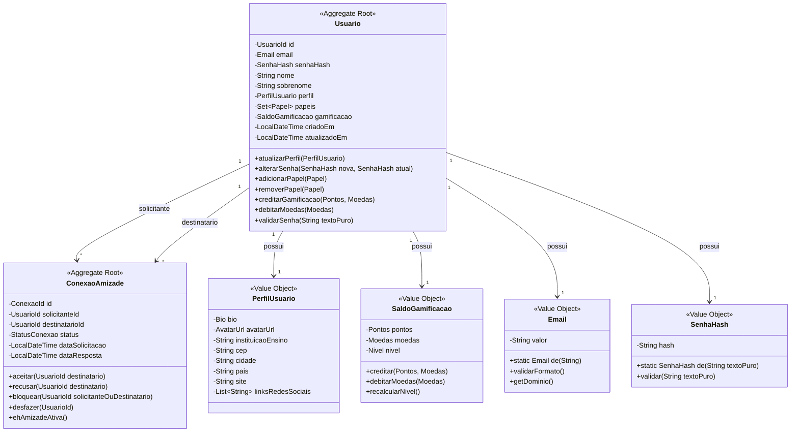

# 🔐 Contexto de Identidade (Identity Context) — Especificação Tática de Domínio

O **Contexto de Identidade** é um **Supporting Subdomain** (Subdomínio de Suporte) responsável pelo gerenciamento seguro do ciclo de vida das credenciais, perfis sociais institucionais, papéis de acesso (`ROLE_ALUNO`, `ROLE_PROFESSOR`, `ROLE_ADMIN`) e o grafo de conexões/amizades entre os acadêmicos.

---

## 🎯 Escopo do Contexto e Linguagem Ubíqua

### Linguagem Ubíqua do Contexto

| Termo | Tipo | Definição |
|-------|------|-----------|
| **Usuario** | Aggregate Root | Membro cadastrado no ecossistema, detentor de credenciais e saldo de gamificação |
| **UsuarioId** | Value Object (Shared Kernel) | Identificador único e imutável (Long/UUID) |
| **Email** | Value Object | Endereço de e-mail com autovalidação sintática (RFC 5322) |
| **SenhaHash** | Value Object | Hash BCrypt/Argon2 — garante que senha em texto puro nunca exista no domínio |
| **Papel** | Enum (Shared Kernel) | `ALUNO`, `PROFESSOR`, `ADMIN` — define capacidades globais no sistema |
| **PerfilUsuario** | Value Object | Apresentação pública: bio, avatar, instituição, links, localização |
| **Bio** | Value Object | Texto livre (máx 500 chars) com sanitização |
| **AvatarUrl** | Value Object | URL validada (HTTPS, domínios permitidos) |
| **ConexaoAmizade** | Aggregate Root | Relacionamento bidirecional entre dois usuários com estado |
| **StatusConexao** | Enum | `PENDENTE`, `ACEITO`, `RECUSADO`, `BLOQUEADO` |
| **SaldoGamificacao** | Value Object | `Pontos`, `Moedas`, `Nivel` — moeda interna de engajamento |
| **Pontos** | Value Object | Inteiro não-negativo (XP) |
| **Moedas** | Value Object | Inteiro não-negativo (moeda virtual) |
| **Nivel** | Enum | `BRONZE`, `PRATA`, `OURO`, `PLATINA`, `DIAMANTE` |

---

## 🏗️ Design Tático: Agregados, Raízes e Fronteiras Transacionais



---

## 📋 Regras de Negócio (Invariantes)

### Usuario
1. **Criação**: `email` deve ser único globalmente; `senha` deve atender política de força (mín 8 chars, maiúscula, número, especial)
2. **Papéis**: Todo usuário inicia com `ALUNO`; `PROFESSOR` requer verificação institucional; `ADMIN` apenas por outro ADMIN
3. **Perfil**: Atualização livre pelo próprio usuário; `bio` sanitizada (sem HTML/JS)
4. **Senha**: Alteração requer senha atual; novo hash gerado com BCrypt cost 12
5. **Gamificação**: 
   - `creditar`: pontos/moedas apenas positivos
   - `debitarMoedas`: não pode resultar em saldo negativo
   - `recalcularNivel`: baseado em thresholds de pontos (ex: 0, 1000, 5000, 15000, 50000)

### ConexaoAmizade
1. **Solicitação**: Não pode solicitar a si mesmo; não pode duplicar conexão existente (qualquer status)
2. **Aceitação**: Apenas `destinatarioId` pode aceitar; transição `PENDENTE` → `ACEITO`
3. **Recusa**: Apenas `destinatarioId` pode recusar; transição `PENDENTE` → `RECUSADO`
4. **Bloqueio**: Qualquer parte pode bloquear; transição para `BLOQUEADO` (irreversível sem ADMIN)
5. **Desfazer**: Apenas se `ACEITO`; remove conexão (soft delete ou hard delete)
6. **Unicidade**: Constraint único em `(solicitante_id, destinatario_id)` — ordem não importa

### PerfilUsuario
1. **Bio**: Máximo 500 caracteres, sanitizada (strip tags)
2. **AvatarUrl**: Deve ser HTTPS; domínios permitidos: `storage.plataforma.com`, `gravatar.com`, `github.com`
3. **Links**: Máximo 5 links; cada um validado como URL HTTPS

---

## 🔄 Domain Events (Eventos de Domínio)

| Evento | Gatilho | Payload Principal | Consumidores |
|--------|---------|-------------------|--------------|
| `UsuarioCriadoEvent` | `Usuario.criar()` | `usuarioId`, `email`, `nome`, `papeis` | Academic (criar perfil aluno), Social (inicializar gamificação), Notification (boas-vindas) |
| `PerfilAtualizadoEvent` | `Usuario.atualizarPerfil()` | `usuarioId`, `perfilAnterior`, `perfilNovo` | Social (atualizar cache de perfil), Search (reindexar) |
| `PapelAdicionadoEvent` | `Usuario.adicionarPapel()` | `usuarioId`, `papelAdicionado`, `adicionadoPor` | Academic (permissões de sala), Social (badges) |
| `SenhaAlteradaEvent` | `Usuario.alterarSenha()` | `usuarioId`, `dataAlteracao` | Security (auditoria), Notification (alerta segurança) |
| `ConexaoSolicitadaEvent` | `ConexaoAmizade.solicitar()` | `conexaoId`, `solicitanteId`, `destinatarioId` | Notification (push para destinatário) |
| `ConexaoAceitaEvent` | `ConexaoAmizade.aceitar()` | `conexaoId`, `solicitanteId`, `destinatarioId` | Notification (ambos), Social (feed "novos amigos"), Gamificação (bônus) |
| `ConexaoRecusadaEvent` | `ConexaoAmizade.recusar()` | `conexaoId`, `destinatarioId` | Notification (solicitante) |
| `UsuarioBloqueadoEvent` | `ConexaoAmizade.bloquear()` | `conexaoId`, `bloqueadorId`, `bloqueadoId` | Academic (remover de salas compartilhadas), Social (ocultar conteúdo) |
| `GamificacaoAtualizadaEvent` | `Usuario.creditarGamificacao()` | `usuarioId`, `pontosDelta`, `moedasDelta`, `novoNivel` | Social (ranking), Notification (conquista) |

---

## 🔌 Ports (Interfaces de Repositório e Serviços)

### Repositories (Domain Layer)
```java
// identitycontext/domain/repository/UsuarioRepository.java
public interface UsuarioRepository {
    Optional<Usuario> findById(UsuarioId id);
    Optional<Usuario> findByEmail(Email email);
    List<Usuario> findByIds(Set<UsuarioId> ids);
    List<Usuario> findByPapel(Papel papel);
    Usuario save(Usuario usuario);
    void delete(UsuarioId id);
    boolean existsByEmail(Email email);
    boolean existsById(UsuarioId id);
    Page<Usuario> findAll(Pageable pageable);
}

// identitycontext/domain/repository/ConexaoAmizadeRepository.java
public interface ConexaoAmizadeRepository {
    Optional<ConexaoAmizade> findById(ConexaoId id);
    Optional<ConexaoAmizade> findByUsuarios(UsuarioId u1, UsuarioId u2); // ordem não importa
    List<ConexaoAmizade> findBySolicitanteId(UsuarioId id);
    List<ConexaoAmizade> findByDestinatarioId(UsuarioId id);
    List<ConexaoAmizade> findByStatus(StatusConexao status);
    List<ConexaoAmizade> findAmizadesAtivas(UsuarioId usuarioId); // ACEITO onde usuario é solicitante OU destinatario
    ConexaoAmizade save(ConexaoAmizade conexao);
    void delete(ConexaoId id);
    long countAmizadesAtivas(UsuarioId usuarioId);
}
```

### Domain Services (Estateless)
```java
// identitycontext/domain/service/PoliticaSenhaService.java
public class PoliticaSenhaService {
    private static final int MIN_LENGTH = 8;
    private static final Pattern UPPERCASE = Pattern.compile("[A-Z]");
    private static final Pattern LOWERCASE = Pattern.compile("[a-z]");
    private static final Pattern DIGIT = Pattern.compile("\\d");
    private static final Pattern SPECIAL = Pattern.compile("[!@#$%^&*()_+\\-=\\[\\]{};':\"\\\\|,.<>/?]");
    
    public void validar(String senha) {
        if (senha == null || senha.length() < MIN_LENGTH) {
            throw new DomainException("Senha deve ter no mínimo " + MIN_LENGTH + " caracteres");
        }
        if (!UPPERCASE.matcher(senha).find()) throw new DomainException("Senha deve conter letra maiúscula");
        if (!LOWERCASE.matcher(senha).find()) throw new DomainException("Senha deve conter letra minúscula");
        if (!DIGIT.matcher(senha).find()) throw new DomainException("Senha deve conter número");
        if (!SPECIAL.matcher(senha).find()) throw new DomainException("Senha deve conter caractere especial");
    }
    
    public SenhaHash gerarHash(String senha) {
        validar(senha);
        return SenhaHash.de(senha); // BCrypt internamente
    }
}

// identitycontext/domain/service/GamificacaoService.java
public class GamificacaoService {
    private static final Map<Nivel, Long> THRESHOLDS = Map.of(
        Nivel.BRONZE, 0L,
        Nivel.PRATA, 1000L,
        Nivel.OURO, 5000L,
        Nivel.PLATINA, 15000L,
        Nivel.DIAMANTE, 50000L
    );
    
    public Nivel calcularNivel(Pontos pontos) {
        return THRESHOLDS.entrySet().stream()
            .filter(e -> pontos.valor() >= e.getValue())
            .max(Map.Entry.comparingByValue())
            .map(Map.Entry::getKey)
            .orElse(Nivel.BRONZE);
    }
    
    public SaldoGamificacao creditar(SaldoGamificacao atual, Pontos pontos, Moedas moedas) {
        var novosPontos = Pontos.de(atual.pontos().valor() + pontos.valor());
        var novasMoedas = Moedas.de(atual.moedas().valor() + moedas.valor());
        var novoNivel = calcularNivel(novosPontos);
        return new SaldoGamificacao(novosPontos, novasMoedas, novoNivel);
    }
}
```

### ACLs (Anti-Corruption Layers) - Para Core Domains
```java
// identitycontext/application/port/out/UsuarioProvider.java (Shared Kernel)
public interface UsuarioProvider {
    Optional<UsuarioInfo> findById(UsuarioId id);
    List<UsuarioInfo> findByIds(Set<UsuarioId> ids);
    boolean existsById(UsuarioId id);
    boolean hasPapel(UsuarioId id, Papel papel);
    
    record UsuarioInfo(
        UsuarioId id,
        String nomeCompleto,
        String email,
        Papel papelPrincipal,
        PerfilUsuario perfil
    ) {}
    
    record PerfilUsuario(
        String bio,
        String avatarUrl,
        String instituicaoEnsino
    ) {}
}

// identitycontext/application/port/out/PerfilProvider.java
public interface PerfilProvider {
    Optional<PerfilCompleto> findByUsuarioId(UsuarioId id);
    List<PerfilCompleto> findByUsuarioIds(Set<UsuarioId> ids);
    
    record PerfilCompleto(
        UsuarioId usuarioId,
        String nomeCompleto,
        PerfilUsuario perfil,
        SaldoGamificacao gamificacao
    ) {}
}
```

---

## 🎯 Application Services (Use Cases)

### UsuarioUseCases
```java
// identitycontext/application/UsuarioUseCases.java
@RequiredArgsConstructor
public class UsuarioUseCases {
    private final UsuarioRepository usuarioRepo;
    private final PoliticaSenhaService senhaService;
    private final DomainEventPublisher eventPublisher;
    
    public UsuarioId registrarUsuario(RegistrarUsuarioCommand cmd) {
        // 1. Validar unicidade
        if (usuarioRepo.existsById(cmd.email())) {
            throw new DomainException("E-mail já cadastrado");
        }
        
        // 2. Criar agregado
        var senhaHash = senhaService.gerarHash(cmd.senha());
        var usuario = Usuario.criar(
            cmd.email(), senhaHash, cmd.nome(), cmd.sobrenome()
        );
        
        // 3. Persistir
        usuarioRepo.save(usuario);
        
        // 4. Evento
        eventPublisher.publish(new UsuarioCriadoEvent(
            usuario.getId(), usuario.getEmail().valor(), 
            usuario.getNomeCompleto(), usuario.getPapeis()
        ));
        
        return usuario.getId();
    }
    
    public void atualizarPerfil(AtualizarPerfilCommand cmd) {
        var usuario = usuarioRepo.findById(cmd.usuarioId())
            .orElseThrow(() -> new NotFoundException("Usuário não encontrado"));
        
        var perfilAnterior = usuario.getPerfil();
        usuario.atualizarPerfil(cmd.perfil());
        usuarioRepo.save(usuario);
        
        eventPublisher.publish(new PerfilAtualizadoEvent(
            cmd.usuarioId(), perfilAnterior, cmd.perfil()
        ));
    }
    
    public void alterarSenha(AlterarSenhaCommand cmd) {
        var usuario = usuarioRepo.findById(cmd.usuarioId())
            .orElseThrow(() -> new NotFoundException("Usuário não encontrado"));
        
        if (!usuario.validarSenha(cmd.senhaAtual())) {
            throw new DomainException("Senha atual incorreta");
        }
        
        var novaHash = senhaService.gerarHash(cmd.novaSenha());
        usuario.alterarSenha(novaHash, usuario.getSenhaHash());
        usuarioRepo.save(usuario);
        
        eventPublisher.publish(new SenhaAlteradaEvent(cmd.usuarioId(), LocalDateTime.now()));
    }
    
    public void adicionarPapel(AdicionarPapelCommand cmd) {
        var usuario = usuarioRepo.findById(cmd.usuarioId())
            .orElseThrow(() -> new NotFoundException("Usuário não encontrado"));
        
        var admin = usuarioRepo.findById(cmd.administradorId())
            .orElseThrow(() -> new NotFoundException("Administrador não encontrado"));
        
        if (!admin.getPapeis().contains(Papel.ADMIN)) {
            throw new DomainException("Apenas administradores podem atribuir papéis");
        }
        
        usuario.adicionarPapel(cmd.papel());
        usuarioRepo.save(usuario);
        
        eventPublisher.publish(new PapelAdicionadoEvent(
            cmd.usuarioId(), cmd.papel(), cmd.administradorId()
        ));
    }
}
```

### ConexaoAmizadeUseCases
```java
// identitycontext/application/ConexaoAmizadeUseCases.java
@RequiredArgsConstructor
public class ConexaoAmizadeUseCases {
    private final ConexaoAmizadeRepository conexaoRepo;
    private final UsuarioRepository usuarioRepo;
    private final DomainEventPublisher eventPublisher;
    
    public ConexaoId solicitarAmizade(SolicitarAmizadeCommand cmd) {
        // Validar usuários existem
        usuarioRepo.findById(cmd.solicitanteId())
            .orElseThrow(() -> new NotFoundException("Solicitante não encontrado"));
        usuarioRepo.findById(cmd.destinatarioId())
            .orElseThrow(() -> new NotFoundException("Destinatário não encontrado"));
        
        if (cmd.solicitanteId().equals(cmd.destinatarioId())) {
            throw new DomainException("Não pode solicitar amizade a si mesmo");
        }
        
        // Verificar conexão existente
        var existente = conexaoRepo.findByUsuarios(cmd.solicitanteId(), cmd.destinatarioId());
        if (existente.isPresent()) {
            throw new DomainException("Conexão já existe: " + existente.get().getStatus());
        }
        
        var conexao = ConexaoAmizade.solicitar(cmd.solicitanteId(), cmd.destinatarioId());
        conexaoRepo.save(conexao);
        
        eventPublisher.publish(new ConexaoSolicitadaEvent(
            conexao.getId(), cmd.solicitanteId(), cmd.destinatarioId()
        ));
        
        return conexao.getId();
    }
    
    public void aceitarAmizade(AceitarAmizadeCommand cmd) {
        var conexao = conexaoRepo.findById(cmd.conexaoId())
            .orElseThrow(() -> new NotFoundException("Conexão não encontrada"));
        
        if (!conexao.getDestinatarioId().equals(cmd.usuarioId())) {
            throw new DomainException("Apenas o destinatário pode aceitar");
        }
        
        conexao.aceitar(cmd.usuarioId());
        conexaoRepo.save(conexao);
        
        eventPublisher.publish(new ConexaoAceitaEvent(
            conexao.getId(), conexao.getSolicitanteId(), conexao.getDestinatarioId()
        ));
    }
    
    public void bloquearUsuario(BloquearUsuarioCommand cmd) {
        var conexao = conexaoRepo.findByUsuarios(cmd.usuarioId(), cmd.alvoId())
            .orElse(() -> {
                // Criar conexão bloqueada se não existir
                return Optional.of(ConexaoAmizade.bloquear(cmd.usuarioId(), cmd.alvoId()));
            })
            .orElseThrow();
        
        conexao.bloquear(cmd.usuarioId());
        conexaoRepo.save(conexao);
        
        eventPublisher.publish(new UsuarioBloqueadoEvent(
            conexao.getId(), cmd.usuarioId(), cmd.alvoId()
        ));
    }
}
```

---

## 🧪 Estratégia de Testes (Domain-First)

### Testes Unitários Puros
```java
// identitycontext/domain/model/usuario/UsuarioTest.java
class UsuarioTest {
    
    @Test
    void deveCriarUsuarioComSenhaValida() {
        var email = Email.de("aluno@universidade.edu.br");
        var senhaHash = SenhaHash.de("SenhaForte123!");
        var usuario = Usuario.criar(email, senhaHash, "João", "Silva");
        
        assertThat(usuario.getEmail()).isEqualTo(email);
        assertThat(usuario.getNomeCompleto()).isEqualTo("João Silva");
        assertThat(usuario.getPapeis()).containsExactly(Papel.ALUNO);
        assertThat(usuario.getGamificacao().pontos().valor()).isZero();
        assertThat(usuario.getGamificacao().nivel()).isEqualTo(Nivel.BRONZE);
    }
    
    @Test
    void deveFalharCriarUsuarioComSenhaFraca() {
        var email = Email.de("test@test.com");
        
        assertThatThrownBy(() -> Usuario.criar(email, SenhaHash.de("123"), "João", "Silva"))
            .isInstanceOf(DomainException.class)
            .hasMessageContaining("Senha deve conter");
    }
    
    @Test
    void deveCreditarGamificacaoERecalcularNivel() {
        var usuario = UsuarioTestBuilder.umUsuario().build();
        
        usuario.creditarGamificacao(Pontos.de(1500), Moedas.de(100));
        
        assertThat(usuario.getGamificacao().pontos().valor()).isEqualTo(1500);
        assertThat(usuario.getGamificacao().nivel()).isEqualTo(Nivel.PRATA);
    }
    
    @Test
    void deveFalharDebitarMoedasAcimaDoSaldo() {
        var usuario = UsuarioTestBuilder.umUsuario()
            .comGamificacao(SaldoGamificacaoTestBuilder.comMoedas(50))
            .build();
        
        assertThatThrownBy(() -> usuario.debitarMoedas(Moedas.de(100)))
            .isInstanceOf(DomainException.class)
            .hasMessageContaining("Saldo insuficiente");
    }
}

// identitycontext/domain/model/conexao/ConexaoAmizadeTest.java
class ConexaoAmizadeTest {
    
    @Test
    void deveSolicitarAmizade() {
        var solicitante = UsuarioId.of(1L);
        var destinatario = UsuarioId.of(2L);
        
        var conexao = ConexaoAmizade.solicitar(solicitante, destinatario);
        
        assertThat(conexao.getStatus()).isEqualTo(StatusConexao.PENDENTE);
        assertThat(conexao.getSolicitanteId()).isEqualTo(solicitante);
        assertThat(conexao.getDestinatarioId()).isEqualTo(destinatario);
    }
    
    @Test
    void deveAceitarAmizade() {
        var conexao = ConexaoAmizadeTestBuilder.umaConexao()
            .pendente()
            .build();
        
        conexao.aceitar(conexao.getDestinatarioId());
        
        assertThat(conexao.getStatus()).isEqualTo(StatusConexao.ACEITO);
        assertThat(conexao.getDataResposta()).isNotNull();
    }
    
    @Test
    void deveFalharAceitarSeNaoDestinatario() {
        var conexao = ConexaoAmizadeTestBuilder.umaConexao()
            .pendente()
            .build();
        
        assertThatThrownBy(() -> conexao.aceitar(UsuarioId.of(999L)))
            .isInstanceOf(DomainException.class)
            .hasMessageContaining("Apenas o destinatário pode aceitar");
    }
    
    @Test
    void deveBloquearUsuario() {
        var conexao = ConexaoAmizadeTestBuilder.umaConexao()
            .aceita()
            .build();
        
        conexao.bloquear(conexao.getSolicitanteId());
        
        assertThat(conexao.getStatus()).isEqualTo(StatusConexao.BLOQUEADO);
    }
}
```

---

## 📦 Value Objects - Especificação Detalhada

### Email
```java
public final class Email implements ValueObject {
    private static final Pattern RFC5322 = Pattern.compile(
        "^[a-zA-Z0-9.!#$%&'*+/=?^_`{|}~-]+@[a-zA-Z0-9](?:[a-zA-Z0-9-]{0,61}[a-zA-Z0-9])?(?:\\.[a-zA-Z0-9](?:[a-zA-Z0-9-]{0,61}[a-zA-Z0-9])?)+$"
    );
    private final String valor;
    
    private Email(String valor) { this.valor = valor.toLowerCase(); }
    
    public static Email de(String valor) {
        if (valor == null || !RFC5322.matcher(valor).matches()) {
            throw new IllegalArgumentException("E-mail inválido: " + valor);
        }
        return new Email(valor);
    }
    
    public String valor() { return valor; }
    public String getDominio() { return valor.substring(valor.indexOf('@') + 1); }
    public boolean isInstitucional() { 
        return getDominio().endsWith(".edu.br") || getDominio().endsWith(".edu"); 
    }
    
    @Override public boolean equals(Object o) { ... }
    @Override public int hashCode() { ... }
}
```

### SenhaHash
```java
public final class SenhaHash implements ValueObject {
    private static final int BCRYPT_COST = 12;
    private final String hash;
    
    private SenhaHash(String hash) { this.hash = hash; }
    
    public static SenhaHash de(String textoPuro) {
        if (textoPuro == null || textoPuro.isBlank()) {
            throw new IllegalArgumentException("Senha não pode ser vazia");
        }
        // BCrypt.hashpw(textoPuro, BCrypt.gensalt(BCRYPT_COST))
        String hash = BCrypt.hashpw(textoPuro, BCrypt.gensalt(BCRYPT_COST));
        return new SenhaHash(hash);
    }
    
    public boolean validar(String textoPuro) {
        if (textoPuro == null) return false;
        return BCrypt.checkpw(textoPuro, hash);
    }
    
    public String hash() { return hash; }
    
    @Override public boolean equals(Object o) { ... }
    @Override public int hashCode() { ... }
}
```

### SaldoGamificacao
```java
public final class SaldoGamificacao implements ValueObject {
    private final Pontos pontos;
    private final Moedas moedas;
    private final Nivel nivel;
    
    public SaldoGamificacao(Pontos pontos, Moedas moedas, Nivel nivel) {
        this.pontos = Objects.requireNonNull(pontos);
        this.moedas = Objects.requireNonNull(moedas);
        this.nivel = Objects.requireNonNull(nivel);
    }
    
    public static SaldoGamificacao inicial() {
        return new SaldoGamificacao(Pontos.zero(), Moedas.zero(), Nivel.BRONZE);
    }
    
    public SaldoGamificacao creditar(Pontos pontos, Moedas moedas) {
        return new SaldoGamificacao(
            Pontos.de(this.pontos.valor() + pontos.valor()),
            Moedas.de(this.moedas.valor() + moedas.valor()),
            Nivel.calcular(this.pontos.valor() + pontos.valor())
        );
    }
    
    public SaldoGamificacao debitarMoedas(Moedas moedas) {
        if (this.moedas.valor() < moedas.valor()) {
            throw new IllegalArgumentException("Saldo insuficiente");
        }
        return new SaldoGamificacao(
            this.pontos,
            Moedas.de(this.moedas.valor() - moedas.valor()),
            this.nivel
        );
    }
    
    public Pontos pontos() { return pontos; }
    public Moedas moedas() { return moedas; }
    public Nivel nivel() { return nivel; }
    
    @Override public boolean equals(Object o) { ... }
    @Override public int hashCode() { ... }
}
```

---

## 🔐 Integração com Spring Security (Adapter)

```java
// identitycontext/infrastructure/security/UsuarioDetailsServiceImpl.java
@Component
@RequiredArgsConstructor
public class UsuarioDetailsServiceImpl implements UserDetailsService {
    private final UsuarioRepository usuarioRepo;
    private final UsuarioMapper mapper;
    
    @Override
    public UserDetails loadUserByUsername(String email) throws UsernameNotFoundException {
        var usuario = usuarioRepo.findByEmail(Email.de(email))
            .orElseThrow(() -> new UsernameNotFoundException("Usuário não encontrado: " + email));
        
        return mapper.toUserDetails(usuario);
    }
}

// identitycontext/infrastructure/security/UsuarioMapper.java
@Component
public class UsuarioMapper {
    public UserDetails toUserDetails(Usuario usuario) {
        var authorities = usuario.getPapeis().stream()
            .map(p -> new SimpleGrantedAuthority("ROLE_" + p.name()))
            .collect(Collectors.toSet());
        
        return User.builder()
            .username(usuario.getEmail().valor())
            .password(usuario.getSenhaHash().hash())
            .authorities(authorities)
            .accountExpired(false)
            .accountLocked(false)
            .credentialsExpired(false)
            .disabled(false)
            .build();
    }
}
```

---

## 📊 Métricas e KPIs do Contexto

| Métrica | Descrição | Fonte |
|---------|-----------|-------|
| `usuarios_ativos_7d` | Usuários com login nos últimos 7 dias | `UsuarioCriadoEvent` + login logs |
| `taxa_conversao_professor` | % usuários que viram PROFESSOR | `PapelAdicionadoEvent` |
| `amizades_por_usuario` | Média de conexões ACEITO por usuário | `ConexaoAceitaEvent` |
| `taxa_aceitacao_amizade` | ACEITO / (ACEITO + RECUSADO) | `ConexaoAceitaEvent` + `ConexaoRecusadaEvent` |
| `distribuicao_nivel` | Histograma de usuários por Nivel | `GamificacaoAtualizadaEvent` |
| `tempo_medio_primeira_amizade` | Tempo entre cadastro e primeira amizade | `UsuarioCriadoEvent` → `ConexaoAceitaEvent` |

---

*Documento versão 1.0 — Agosto 2026 — Contexto de Identidade*